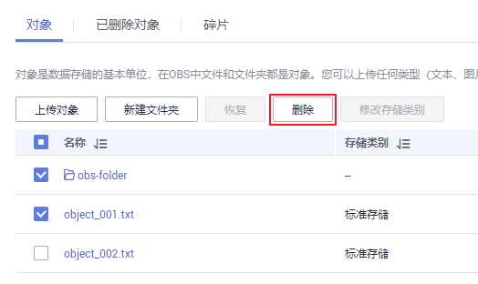
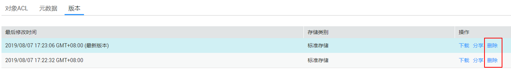
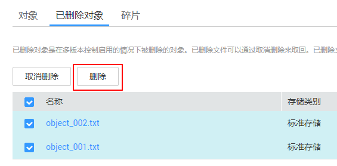
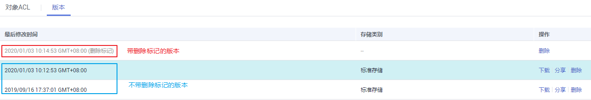

# 删除文件或文件夹

## 操作场景

为节省空间和成本，您可以通过OBS管理控制台删除无用的文件或文件夹。

本小节主要介绍如何在OBS管理控制台上手动删除文件或文件夹。

除此之外，OBS还提供了生命周期管理功能，来满足您定期自动删除桶中文件或者一次性清空桶中所有文件和文件夹的诉求。详情请参见[生命周期管理简介](生命周期管理简介.md)。

## 背景知识

**多版本控制功能启用时的对象删除机制**

桶的多版本控制功能启用时，删除的目标不同，OBS会采取不同的处理方式：

-   删除文件或文件夹：文件或文件夹不会立即被彻底删除，而是保留在“已删除对象”列表中，同时会为文件打上删除标记。

    **图 1**  删除文件或文件夹  
    

    -   如果想要彻底删除，需要再到“已删除对象”列表进行删除。删除方法请参见本小节的[操作步骤](#section56466209)。
    -   如果想要找回删除的文件，可以通过“取消删除“功能来找回。找回方法请参见[取消删除文件](取消删除文件.md)。

-   删除文件的某个版本：该版本会被彻底删除且无法恢复。如果删除的是文件的最新版本，那么时间最近的那个历史版本将会变成最新版本。

    **图 2**  删除文件的某个版本  
    

## 操作步骤

1.  在OBS管理控制台左侧导航栏选择“对象存储“。
2.  在桶列表单击待操作的桶，进入“概览”页面。
3.  在左侧导航栏，单击“对象”。
4.  选中待删除的文件或文件夹，并单击右侧的“更多 \> 删除”。

    也可以选中多个文件或文件夹，单击文件列表上方的“删除”删除进行批量删除。

    **图 3**  删除文件或文件夹  
    

5.  单击“是”，确认删除文件或文件夹。
6.  对于启用了多版本控制的OBS桶，想要彻底删除文件或文件夹，需要再到“已删除对象”列表进行删除。
    1.  单击“已删除对象”。
    2.  在待删除的文件或文件夹所在行的操作列，单击“删除”。

        也可以选中多个文件或文件夹，单击文件列表上方的“删除”进行批量删除。

        **图 4**  彻底删除文件或文件夹  
        

## 相关操作

在多版本控制功能启用的场景下，在“已删除对象”中的文件仍然会保留多版本，在对不同的版本进行删除时需要注意：

**图 5**  “已删除对象”中文件的版本列表  

-   如果删除的是带“删除标记”的版本，实际上是找回该文件，等同于“取消删除“文件，而非彻底删除。相关方法请参见[取消删除文件](取消删除文件.md)的相关操作。
-   如果删除的是不带“删除标记”的版本，则会彻底删除该历史版本，即使后续该文件找回后，也无法恢复这个被彻底删除的历史版本。

