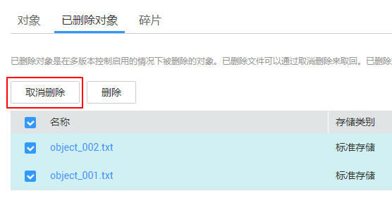

# 取消删除文件

## 操作场景

在启用了[多版本控制](多版本控制简介.md)功能的OBS桶中，如果想将删除的文件找回，可以通过“取消删除“功能来实现。

## 背景知识

**多版本控制功能启用时的对象删除机制**

桶的多版本控制功能启用时，删除的目标不同，OBS会采取不同的处理方式：

-   删除文件或文件夹：文件或文件夹不会立即被彻底删除，而是保留在“已删除对象”列表中，同时会为文件打上删除标记。

    **图 1**  删除文件或文件夹  
    

    -   如果想要彻底删除，需要再到“已删除对象”列表进行删除。删除方法请参见[删除文件或文件夹](删除文件或文件夹.md)。
    -   如果想要找回删除的文件，可以通过“取消删除“功能来找回。找回方法请参见本小节的[操作步骤](#section50464659154530)。

-   删除文件的某个版本：该版本会被彻底删除且无法恢复。如果删除的是文件的最新版本，那么时间最近的那个历史版本将会变成最新版本。

    **图 2**  删除文件的某个版本  
    

**多版本控制功能启用时的对象找回机制**

启用了多版本控制功能的OBS桶中的文件从“对象”列表删除后，OBS不会立即将其彻底删除，而是保留在“已删除对象”中，同时会为其打上删除标记。您可以通过“取消删除“功能来找回被删除的文件。

使用“取消删除“功能需要注意以下几点：

1.  只支持对文件“取消删除“，不支持对文件夹“取消删除“。

    “取消删除“文件后，该文件会恢复到“对象”列表中，此时可以正常使用对象的基本功能。如果文件存放于某个文件夹下，“取消删除“文件后依然会保留原有的目录结构。

2.  “已删除对象”中的文件仍然会保留多版本，在对不同的版本进行删除时需要注意：

    -   如果删除的是带“删除标记”的版本，实际上是找回该文件，等同于“取消删除“文件，而非彻底删除。具体步骤请参见[相关操作](#section27691114163422)。
    -   如果删除的是不带“删除标记”的版本，则会彻底删除该历史版本。即使后续该文件找回后，也无法恢复这个被彻底删除的历史版本。

    **图 3**  “已删除对象”中文件的版本列表  
    

3.  “已删除对象”中的文件至少需要保留一个不带“删除标记”的历史版本，否则无法执行“取消删除“操作。

## 前提条件

-   OBS桶的多版本控制功能已启用。启用方法请参见[配置多版本控制](配置多版本控制.md)。
-   待找回的文件在“已删除对象”列表中，未被彻底删除，且至少保留一个不带“删除标记”的历史版本。

## 操作步骤

1.  在OBS管理控制台左侧导航栏选择“对象存储“。
2.  在桶列表单击待操作的桶，进入“概览”页面。
3.  在左侧导航栏，单击“对象”。
4.  单击“已删除对象”。
5.  在要找回的已删除文件所在行，单击右侧的“取消删除“。

    也可以选中多个文件，单击文件列表上方的“取消删除“进行批量找回。

    **图 4**  取消删除文件  
    

## 相关操作

**通过删除带“删除标记”的版本来找回文件的方法：**

1.  在OBS管理控制台左侧导航栏选择“对象存储“。
2.  在桶列表单击待操作的桶，进入“概览”页面。
3.  在左侧导航栏，单击“对象”。
4.  单击“已删除对象”。
5.  单击要找回的文件名称，系统显示该文件信息。
6.  在“版本”页签，显示该文件的所有版本。

    **图 5**  “已删除对象”中文件的版本列表  
    

    -   删除带“删除标记”的版本，将找回该文件，恢复到“对象”列表中。
    -   删除不带“删除标记”的历史版本，将彻底删除该历史版本。

