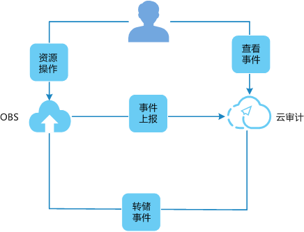

# 审计

云审计服务（Cloud Trace Service，简称CTS），是华为云安全解决方案中专业的日志审计服务，提供对各种云资源操作记录的收集、存储和查询功能，可用于支撑安全分析、合规审计、资源跟踪和问题定位等常见应用场景。

**图 1**  云审计服务  

## 操作步骤

1.  登录管理控制台。
2.  在管理控制台左上角单击图标，选择区域和项目。
3.  选择“服务列表\>管理与部署\>云审计服务”，进入云审计服务信息页面。
4.  请参考云审计服务的[配置追踪器](https://support.huaweicloud.com/usermanual-cts/zh-cn_topic_0059288681.html)，配置OBS的云审计。

    **表 1**  云审计服务支持的OBS管理事件操作列表

    
    <table><thead align="left"><tr id="row2066815632911"><th class="cellrowborder" valign="top" width="27%" id="mcps1.2.5.1.1">
追踪器类型

    </th>
    <th class="cellrowborder" valign="top" width="26%" id="mcps1.2.5.1.2">
操作名称

    </th>
    <th class="cellrowborder" valign="top" width="16%" id="mcps1.2.5.1.3">
资源类型

    </th>
    <th class="cellrowborder" valign="top" width="31%" id="mcps1.2.5.1.4">
事件名称

    </th>
    </tr>
    </thead>
    <tbody><tr id="row12680126102912"><td class="cellrowborder" valign="top" width="27%" headers="mcps1.2.5.1.1 ">
管理类事件

    </td>
    <td class="cellrowborder" valign="top" width="26%" headers="mcps1.2.5.1.2 ">
删除桶

    </td>
    <td class="cellrowborder" valign="top" width="16%" headers="mcps1.2.5.1.3 ">
桶

    </td>
    <td class="cellrowborder" valign="top" width="31%" headers="mcps1.2.5.1.4 ">
deleteBucket

    </td>
    </tr>
    <tr id="row16692106102914"><td class="cellrowborder" valign="top" width="27%" headers="mcps1.2.5.1.1 ">
管理类事件

    </td>
    <td class="cellrowborder" valign="top" width="26%" headers="mcps1.2.5.1.2 ">
删除桶跨资源共享配置

    </td>
    <td class="cellrowborder" valign="top" width="16%" headers="mcps1.2.5.1.3 ">
桶

    </td>
    <td class="cellrowborder" valign="top" width="31%" headers="mcps1.2.5.1.4 ">
deleteBucketCors

    </td>
    </tr>
    <tr id="row4704962293"><td class="cellrowborder" valign="top" width="27%" headers="mcps1.2.5.1.1 ">
管理类事件

    </td>
    <td class="cellrowborder" valign="top" width="26%" headers="mcps1.2.5.1.2 ">
删除自定义域名配置

    </td>
    <td class="cellrowborder" valign="top" width="16%" headers="mcps1.2.5.1.3 ">
桶

    </td>
    <td class="cellrowborder" valign="top" width="31%" headers="mcps1.2.5.1.4 ">
deleteBucketCustomdomain

    </td>
    </tr>
    <tr id="row171413692911"><td class="cellrowborder" valign="top" width="27%" headers="mcps1.2.5.1.1 ">
管理类事件

    </td>
    <td class="cellrowborder" valign="top" width="26%" headers="mcps1.2.5.1.2 ">
删除桶生命周期配置

    </td>
    <td class="cellrowborder" valign="top" width="16%" headers="mcps1.2.5.1.3 ">
桶

    </td>
    <td class="cellrowborder" valign="top" width="31%" headers="mcps1.2.5.1.4 ">
deleteBucketLifecycle

    </td>
    </tr>
    <tr id="row57265672913"><td class="cellrowborder" valign="top" width="27%" headers="mcps1.2.5.1.1 ">
管理类事件

    </td>
    <td class="cellrowborder" valign="top" width="26%" headers="mcps1.2.5.1.2 ">
删除桶策略配置

    </td>
    <td class="cellrowborder" valign="top" width="16%" headers="mcps1.2.5.1.3 ">
桶

    </td>
    <td class="cellrowborder" valign="top" width="31%" headers="mcps1.2.5.1.4 ">
deleteBucketPolicy

    </td>
    </tr>
    <tr id="row37355614291"><td class="cellrowborder" valign="top" width="27%" headers="mcps1.2.5.1.1 ">
管理类事件

    </td>
    <td class="cellrowborder" valign="top" width="26%" headers="mcps1.2.5.1.2 ">
删除桶的跨区域复制配置

    </td>
    <td class="cellrowborder" valign="top" width="16%" headers="mcps1.2.5.1.3 ">
桶

    </td>
    <td class="cellrowborder" valign="top" width="31%" headers="mcps1.2.5.1.4 ">
deleteBucketReplication

    </td>
    </tr>
    <tr id="row7744565295"><td class="cellrowborder" valign="top" width="27%" headers="mcps1.2.5.1.1 ">
管理类事件

    </td>
    <td class="cellrowborder" valign="top" width="26%" headers="mcps1.2.5.1.2 ">
删除桶标签配置

    </td>
    <td class="cellrowborder" valign="top" width="16%" headers="mcps1.2.5.1.3 ">
桶

    </td>
    <td class="cellrowborder" valign="top" width="31%" headers="mcps1.2.5.1.4 ">
deleteBucketTagging

    </td>
    </tr>
    <tr id="row17571665297"><td class="cellrowborder" valign="top" width="27%" headers="mcps1.2.5.1.1 ">
管理类事件

    </td>
    <td class="cellrowborder" valign="top" width="26%" headers="mcps1.2.5.1.2 ">
删除桶静态网站配置

    </td>
    <td class="cellrowborder" valign="top" width="16%" headers="mcps1.2.5.1.3 ">
桶

    </td>
    <td class="cellrowborder" valign="top" width="31%" headers="mcps1.2.5.1.4 ">
deleteBucketWebsite

    </td>
    </tr>
    <tr id="row876520620293"><td class="cellrowborder" valign="top" width="27%" headers="mcps1.2.5.1.1 ">
管理类事件

    </td>
    <td class="cellrowborder" valign="top" width="26%" headers="mcps1.2.5.1.2 ">
删除桶内数据

    </td>
    <td class="cellrowborder" valign="top" width="16%" headers="mcps1.2.5.1.3 ">
桶

    </td>
    <td class="cellrowborder" valign="top" width="31%" headers="mcps1.2.5.1.4 ">
deleteBucketdata

    </td>
    </tr>
    <tr id="row4785166162919"><td class="cellrowborder" valign="top" width="27%" headers="mcps1.2.5.1.1 ">
管理类事件

    </td>
    <td class="cellrowborder" valign="top" width="26%" headers="mcps1.2.5.1.2 ">
创建桶

    </td>
    <td class="cellrowborder" valign="top" width="16%" headers="mcps1.2.5.1.3 ">
桶

    </td>
    <td class="cellrowborder" valign="top" width="31%" headers="mcps1.2.5.1.4 ">
createBucket

    </td>
    </tr>
    <tr id="row12793166132920"><td class="cellrowborder" valign="top" width="27%" headers="mcps1.2.5.1.1 ">
管理类事件

    </td>
    <td class="cellrowborder" valign="top" width="26%" headers="mcps1.2.5.1.2 ">
设置桶的ACL

    </td>
    <td class="cellrowborder" valign="top" width="16%" headers="mcps1.2.5.1.3 ">
桶

    </td>
    <td class="cellrowborder" valign="top" width="31%" headers="mcps1.2.5.1.4 ">
setBucketAcl

    </td>
    </tr>
    <tr id="row080617617290"><td class="cellrowborder" valign="top" width="27%" headers="mcps1.2.5.1.1 ">
管理类事件

    </td>
    <td class="cellrowborder" valign="top" width="26%" headers="mcps1.2.5.1.2 ">
设置桶的跨资源共享规则

    </td>
    <td class="cellrowborder" valign="top" width="16%" headers="mcps1.2.5.1.3 ">
桶

    </td>
    <td class="cellrowborder" valign="top" width="31%" headers="mcps1.2.5.1.4 ">
setBucketCors

    </td>
    </tr>
    <tr id="row981513615299"><td class="cellrowborder" valign="top" width="27%" headers="mcps1.2.5.1.1 ">
管理类事件

    </td>
    <td class="cellrowborder" valign="top" width="26%" headers="mcps1.2.5.1.2 ">
设置桶的自定义域名

    </td>
    <td class="cellrowborder" valign="top" width="16%" headers="mcps1.2.5.1.3 ">
桶

    </td>
    <td class="cellrowborder" valign="top" width="31%" headers="mcps1.2.5.1.4 ">
setBucketCustomdomain

    </td>
    </tr>
    <tr id="row882413616299"><td class="cellrowborder" valign="top" width="27%" headers="mcps1.2.5.1.1 ">
管理类事件

    </td>
    <td class="cellrowborder" valign="top" width="26%" headers="mcps1.2.5.1.2 ">
设置桶的生命周期

    </td>
    <td class="cellrowborder" valign="top" width="16%" headers="mcps1.2.5.1.3 ">
桶

    </td>
    <td class="cellrowborder" valign="top" width="31%" headers="mcps1.2.5.1.4 ">
setBucketLifecycle

    </td>
    </tr>
    <tr id="row6834126182916"><td class="cellrowborder" valign="top" width="27%" headers="mcps1.2.5.1.1 ">
管理类事件

    </td>
    <td class="cellrowborder" valign="top" width="26%" headers="mcps1.2.5.1.2 ">
设置桶的事件记录配置

    </td>
    <td class="cellrowborder" valign="top" width="16%" headers="mcps1.2.5.1.3 ">
桶

    </td>
    <td class="cellrowborder" valign="top" width="31%" headers="mcps1.2.5.1.4 ">
setBucketLogging

    </td>
    </tr>
    <tr id="row20841464293"><td class="cellrowborder" valign="top" width="27%" headers="mcps1.2.5.1.1 ">
管理类事件

    </td>
    <td class="cellrowborder" valign="top" width="26%" headers="mcps1.2.5.1.2 ">
设置桶的通知配置

    </td>
    <td class="cellrowborder" valign="top" width="16%" headers="mcps1.2.5.1.3 ">
桶

    </td>
    <td class="cellrowborder" valign="top" width="31%" headers="mcps1.2.5.1.4 ">
setBucketNotification

    </td>
    </tr>
    <tr id="row128510662912"><td class="cellrowborder" valign="top" width="27%" headers="mcps1.2.5.1.1 ">
管理类事件

    </td>
    <td class="cellrowborder" valign="top" width="26%" headers="mcps1.2.5.1.2 ">
设置桶的策略

    </td>
    <td class="cellrowborder" valign="top" width="16%" headers="mcps1.2.5.1.3 ">
桶

    </td>
    <td class="cellrowborder" valign="top" width="31%" headers="mcps1.2.5.1.4 ">
setBucketPolicy

    </td>
    </tr>
    <tr id="row1786156122919"><td class="cellrowborder" valign="top" width="27%" headers="mcps1.2.5.1.1 ">
管理类事件

    </td>
    <td class="cellrowborder" valign="top" width="26%" headers="mcps1.2.5.1.2 ">
设置桶的配额

    </td>
    <td class="cellrowborder" valign="top" width="16%" headers="mcps1.2.5.1.3 ">
桶

    </td>
    <td class="cellrowborder" valign="top" width="31%" headers="mcps1.2.5.1.4 ">
setBucketQuota

    </td>
    </tr>
    <tr id="row686911616297"><td class="cellrowborder" valign="top" width="27%" headers="mcps1.2.5.1.1 ">
管理类事件

    </td>
    <td class="cellrowborder" valign="top" width="26%" headers="mcps1.2.5.1.2 ">
设置桶的跨区域复制

    </td>
    <td class="cellrowborder" valign="top" width="16%" headers="mcps1.2.5.1.3 ">
桶

    </td>
    <td class="cellrowborder" valign="top" width="31%" headers="mcps1.2.5.1.4 ">
setBucketReplication

    </td>
    </tr>
    <tr id="row788056192910"><td class="cellrowborder" valign="top" width="27%" headers="mcps1.2.5.1.1 ">
管理类事件

    </td>
    <td class="cellrowborder" valign="top" width="26%" headers="mcps1.2.5.1.2 ">
设置桶的存储级别

    </td>
    <td class="cellrowborder" valign="top" width="16%" headers="mcps1.2.5.1.3 ">
桶

    </td>
    <td class="cellrowborder" valign="top" width="31%" headers="mcps1.2.5.1.4 ">
setBucketStorageclass

    </td>
    </tr>
    <tr id="row11892176192911"><td class="cellrowborder" valign="top" width="27%" headers="mcps1.2.5.1.1 ">
管理类事件

    </td>
    <td class="cellrowborder" valign="top" width="26%" headers="mcps1.2.5.1.2 ">
设置桶的标签

    </td>
    <td class="cellrowborder" valign="top" width="16%" headers="mcps1.2.5.1.3 ">
桶

    </td>
    <td class="cellrowborder" valign="top" width="31%" headers="mcps1.2.5.1.4 ">
setBucketTagging

    </td>
    </tr>
    <tr id="row18990618295"><td class="cellrowborder" valign="top" width="27%" headers="mcps1.2.5.1.1 ">
管理类事件

    </td>
    <td class="cellrowborder" valign="top" width="26%" headers="mcps1.2.5.1.2 ">
设置桶的多版本

    </td>
    <td class="cellrowborder" valign="top" width="16%" headers="mcps1.2.5.1.3 ">
桶

    </td>
    <td class="cellrowborder" valign="top" width="31%" headers="mcps1.2.5.1.4 ">
setBucketVersioning

    </td>
    </tr>
    <tr id="row109081267298"><td class="cellrowborder" valign="top" width="27%" headers="mcps1.2.5.1.1 ">
管理类事件

    </td>
    <td class="cellrowborder" valign="top" width="26%" headers="mcps1.2.5.1.2 ">
设置桶的静态域名

    </td>
    <td class="cellrowborder" valign="top" width="16%" headers="mcps1.2.5.1.3 ">
桶

    </td>
    <td class="cellrowborder" valign="top" width="31%" headers="mcps1.2.5.1.4 ">
setBucketWebsite

    </td>
    </tr>
    </tbody>
    </table>

    **表 2**  云审计服务支持的OBS数据事件操作列表

    
    <table><thead align="left"><tr id="row172451434103110"><th class="cellrowborder" valign="top" width="17.82178217821782%" id="mcps1.2.5.1.1">
追踪器类型

    </th>
    <th class="cellrowborder" valign="top" width="25.742574257425744%" id="mcps1.2.5.1.2">
操作名称

    </th>
    <th class="cellrowborder" valign="top" width="23.762376237623762%" id="mcps1.2.5.1.3">
资源类型

    </th>
    <th class="cellrowborder" valign="top" width="32.67326732673268%" id="mcps1.2.5.1.4">
事件名称

    </th>
    </tr>
    </thead>
    <tbody><tr id="row192621834103118"><td class="cellrowborder" valign="top" width="17.82178217821782%" headers="mcps1.2.5.1.1 ">
数据事件_读操作

    </td>
    <td class="cellrowborder" valign="top" width="25.742574257425744%" headers="mcps1.2.5.1.2 ">
下载对象

    </td>
    <td class="cellrowborder" valign="top" width="23.762376237623762%" headers="mcps1.2.5.1.3 ">
对象

    </td>
    <td class="cellrowborder" valign="top" width="32.67326732673268%" headers="mcps1.2.5.1.4 ">
GET.OBJECT

    </td>
    </tr>
    <tr id="row52627342311"><td class="cellrowborder" valign="top" width="17.82178217821782%" headers="mcps1.2.5.1.1 ">
数据事件_读操作

    </td>
    <td class="cellrowborder" valign="top" width="25.742574257425744%" headers="mcps1.2.5.1.2 ">
查询对象ACL配置

    </td>
    <td class="cellrowborder" valign="top" width="23.762376237623762%" headers="mcps1.2.5.1.3 ">
对象

    </td>
    <td class="cellrowborder" valign="top" width="32.67326732673268%" headers="mcps1.2.5.1.4 ">
GET.OBJECT.ACL

    </td>
    </tr>
    <tr id="row12262193419317"><td class="cellrowborder" valign="top" width="17.82178217821782%" headers="mcps1.2.5.1.1 ">
数据事件_读操作

    </td>
    <td class="cellrowborder" valign="top" width="25.742574257425744%" headers="mcps1.2.5.1.2 ">
查询桶website配置

    </td>
    <td class="cellrowborder" valign="top" width="23.762376237623762%" headers="mcps1.2.5.1.3 ">
对象

    </td>
    <td class="cellrowborder" valign="top" width="32.67326732673268%" headers="mcps1.2.5.1.4 ">
GET.OBJECT.WEBSITE

    </td>
    </tr>
    <tr id="row126219343313"><td class="cellrowborder" valign="top" width="17.82178217821782%" headers="mcps1.2.5.1.1 ">
数据事件_读操作

    </td>
    <td class="cellrowborder" valign="top" width="25.742574257425744%" headers="mcps1.2.5.1.2 ">
通过website方式访问对象

    </td>
    <td class="cellrowborder" valign="top" width="23.762376237623762%" headers="mcps1.2.5.1.3 ">
对象

    </td>
    <td class="cellrowborder" valign="top" width="32.67326732673268%" headers="mcps1.2.5.1.4 ">
HEAD.OBJECT.WEBSITE

    </td>
    </tr>
    <tr id="row13262634203118"><td class="cellrowborder" valign="top" width="17.82178217821782%" headers="mcps1.2.5.1.1 ">
数据事件_读操作

    </td>
    <td class="cellrowborder" valign="top" width="25.742574257425744%" headers="mcps1.2.5.1.2 ">
查询对象元数据

    </td>
    <td class="cellrowborder" valign="top" width="23.762376237623762%" headers="mcps1.2.5.1.3 ">
对象

    </td>
    <td class="cellrowborder" valign="top" width="32.67326732673268%" headers="mcps1.2.5.1.4 ">
HEAD.OBJECT

    </td>
    </tr>
    <tr id="row17262173414319"><td class="cellrowborder" valign="top" width="17.82178217821782%" headers="mcps1.2.5.1.1 ">
数据事件_读操作

    </td>
    <td class="cellrowborder" valign="top" width="25.742574257425744%" headers="mcps1.2.5.1.2 ">
列举段数据

    </td>
    <td class="cellrowborder" valign="top" width="23.762376237623762%" headers="mcps1.2.5.1.3 ">
对象

    </td>
    <td class="cellrowborder" valign="top" width="32.67326732673268%" headers="mcps1.2.5.1.4 ">
LIST.OBJECT.UPLOAD

    </td>
    </tr>
    <tr id="row15262173483115"><td class="cellrowborder" valign="top" width="17.82178217821782%" headers="mcps1.2.5.1.1 ">
数据事件_写操作

    </td>
    <td class="cellrowborder" valign="top" width="25.742574257425744%" headers="mcps1.2.5.1.2 ">
删除对象

    </td>
    <td class="cellrowborder" valign="top" width="23.762376237623762%" headers="mcps1.2.5.1.3 ">
对象

    </td>
    <td class="cellrowborder" valign="top" width="32.67326732673268%" headers="mcps1.2.5.1.4 ">
DELETE.OBJECT

    </td>
    </tr>
    <tr id="row1326210341311"><td class="cellrowborder" valign="top" width="17.82178217821782%" headers="mcps1.2.5.1.1 ">
数据事件_写操作

    </td>
    <td class="cellrowborder" valign="top" width="25.742574257425744%" headers="mcps1.2.5.1.2 ">
取消段

    </td>
    <td class="cellrowborder" valign="top" width="23.762376237623762%" headers="mcps1.2.5.1.3 ">
对象

    </td>
    <td class="cellrowborder" valign="top" width="32.67326732673268%" headers="mcps1.2.5.1.4 ">
DELETE.UPLOAD

    </td>
    </tr>
    <tr id="row1926214349313"><td class="cellrowborder" valign="top" width="17.82178217821782%" headers="mcps1.2.5.1.1 ">
数据事件_写操作

    </td>
    <td class="cellrowborder" valign="top" width="25.742574257425744%" headers="mcps1.2.5.1.2 ">
查询对象的跨域请求

    </td>
    <td class="cellrowborder" valign="top" width="23.762376237623762%" headers="mcps1.2.5.1.3 ">
对象

    </td>
    <td class="cellrowborder" valign="top" width="32.67326732673268%" headers="mcps1.2.5.1.4 ">
OPTIONS.OBJECT

    </td>
    </tr>
    <tr id="row3262234153116"><td class="cellrowborder" valign="top" width="17.82178217821782%" headers="mcps1.2.5.1.1 ">
数据事件_写操作

    </td>
    <td class="cellrowborder" valign="top" width="25.742574257425744%" headers="mcps1.2.5.1.2 ">
上传对象

    </td>
    <td class="cellrowborder" valign="top" width="23.762376237623762%" headers="mcps1.2.5.1.3 ">
对象

    </td>
    <td class="cellrowborder" valign="top" width="32.67326732673268%" headers="mcps1.2.5.1.4 ">
POST.OBJECT

    </td>
    </tr>
    <tr id="row102621334173116"><td class="cellrowborder" valign="top" width="17.82178217821782%" headers="mcps1.2.5.1.1 ">
数据事件_写操作

    </td>
    <td class="cellrowborder" valign="top" width="25.742574257425744%" headers="mcps1.2.5.1.2 ">
批量删除对象

    </td>
    <td class="cellrowborder" valign="top" width="23.762376237623762%" headers="mcps1.2.5.1.3 ">
对象

    </td>
    <td class="cellrowborder" valign="top" width="32.67326732673268%" headers="mcps1.2.5.1.4 ">
POST.OBJECT.MULTIDELETE

    </td>
    </tr>
    <tr id="row6262173415311"><td class="cellrowborder" valign="top" width="17.82178217821782%" headers="mcps1.2.5.1.1 ">
数据事件_写操作

    </td>
    <td class="cellrowborder" valign="top" width="25.742574257425744%" headers="mcps1.2.5.1.2 ">
冷对象取回

    </td>
    <td class="cellrowborder" valign="top" width="23.762376237623762%" headers="mcps1.2.5.1.3 ">
对象

    </td>
    <td class="cellrowborder" valign="top" width="32.67326732673268%" headers="mcps1.2.5.1.4 ">
POST.OBJECT.RESTORE

    </td>
    </tr>
    <tr id="row226293453119"><td class="cellrowborder" valign="top" width="17.82178217821782%" headers="mcps1.2.5.1.1 ">
数据事件_写操作

    </td>
    <td class="cellrowborder" valign="top" width="25.742574257425744%" headers="mcps1.2.5.1.2 ">
合并段

    </td>
    <td class="cellrowborder" valign="top" width="23.762376237623762%" headers="mcps1.2.5.1.3 ">
对象

    </td>
    <td class="cellrowborder" valign="top" width="32.67326732673268%" headers="mcps1.2.5.1.4 ">
POST.UPLOAD.COMPLETE

    </td>
    </tr>
    <tr id="row1426273410318"><td class="cellrowborder" valign="top" width="17.82178217821782%" headers="mcps1.2.5.1.1 ">
数据事件_写操作

    </td>
    <td class="cellrowborder" valign="top" width="25.742574257425744%" headers="mcps1.2.5.1.2 ">
初始化段

    </td>
    <td class="cellrowborder" valign="top" width="23.762376237623762%" headers="mcps1.2.5.1.3 ">
对象

    </td>
    <td class="cellrowborder" valign="top" width="32.67326732673268%" headers="mcps1.2.5.1.4 ">
POST.UPLOAD.INIT

    </td>
    </tr>
    <tr id="row1126213349313"><td class="cellrowborder" valign="top" width="17.82178217821782%" headers="mcps1.2.5.1.1 ">
数据事件_写操作

    </td>
    <td class="cellrowborder" valign="top" width="25.742574257425744%" headers="mcps1.2.5.1.2 ">
上传对象

    </td>
    <td class="cellrowborder" valign="top" width="23.762376237623762%" headers="mcps1.2.5.1.3 ">
对象

    </td>
    <td class="cellrowborder" valign="top" width="32.67326732673268%" headers="mcps1.2.5.1.4 ">
PUT.OBJECT

    </td>
    </tr>
    <tr id="row172621434183115"><td class="cellrowborder" valign="top" width="17.82178217821782%" headers="mcps1.2.5.1.1 ">
数据事件_写操作

    </td>
    <td class="cellrowborder" valign="top" width="25.742574257425744%" headers="mcps1.2.5.1.2 ">
设置对象的ACL

    </td>
    <td class="cellrowborder" valign="top" width="23.762376237623762%" headers="mcps1.2.5.1.3 ">
对象

    </td>
    <td class="cellrowborder" valign="top" width="32.67326732673268%" headers="mcps1.2.5.1.4 ">
PUT.OBJECT.ACL

    </td>
    </tr>
    <tr id="row12262193419318"><td class="cellrowborder" valign="top" width="17.82178217821782%" headers="mcps1.2.5.1.1 ">
数据事件_写操作

    </td>
    <td class="cellrowborder" valign="top" width="25.742574257425744%" headers="mcps1.2.5.1.2 ">
拷贝对象

    </td>
    <td class="cellrowborder" valign="top" width="23.762376237623762%" headers="mcps1.2.5.1.3 ">
对象

    </td>
    <td class="cellrowborder" valign="top" width="32.67326732673268%" headers="mcps1.2.5.1.4 ">
PUT.OBJECT.COPY

    </td>
    </tr>
    <tr id="row72621434153119"><td class="cellrowborder" valign="top" width="17.82178217821782%" headers="mcps1.2.5.1.1 ">
数据事件_写操作

    </td>
    <td class="cellrowborder" valign="top" width="25.742574257425744%" headers="mcps1.2.5.1.2 ">
设置对象的存储级别

    </td>
    <td class="cellrowborder" valign="top" width="23.762376237623762%" headers="mcps1.2.5.1.3 ">
对象

    </td>
    <td class="cellrowborder" valign="top" width="32.67326732673268%" headers="mcps1.2.5.1.4 ">
PUT.OBJECT.STORAGECLASS

    </td>
    </tr>
    <tr id="row10262113415314"><td class="cellrowborder" valign="top" width="17.82178217821782%" headers="mcps1.2.5.1.1 ">
数据事件_写操作

    </td>
    <td class="cellrowborder" valign="top" width="25.742574257425744%" headers="mcps1.2.5.1.2 ">
上传段

    </td>
    <td class="cellrowborder" valign="top" width="23.762376237623762%" headers="mcps1.2.5.1.3 ">
对象

    </td>
    <td class="cellrowborder" valign="top" width="32.67326732673268%" headers="mcps1.2.5.1.4 ">
PUT.PART

    </td>
    </tr>
    <tr id="row152623342316"><td class="cellrowborder" valign="top" width="17.82178217821782%" headers="mcps1.2.5.1.1 ">
数据事件_写操作

    </td>
    <td class="cellrowborder" valign="top" width="25.742574257425744%" headers="mcps1.2.5.1.2 ">
拷贝段

    </td>
    <td class="cellrowborder" valign="top" width="23.762376237623762%" headers="mcps1.2.5.1.3 ">
对象

    </td>
    <td class="cellrowborder" valign="top" width="32.67326732673268%" headers="mcps1.2.5.1.4 ">
PUT.PART.COPY

    </td>
    </tr>
    </tbody>
    </table>

## 后续操作

在追踪器信息右侧，单击操作下的“停用”可以停用追踪器。追踪器停用成功后，系统将不再记录新的操作，但是您依旧可以查看已有的操作记录。

在追踪器信息右侧，单击操作下的“删除”可以删除追踪器。删除追踪器对已有的操作记录没有影响，当您重新开通云审计服务后，依旧可以查看已有的操作记录。

