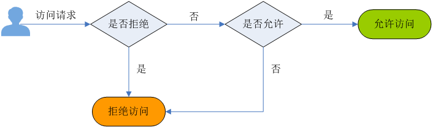

# 对象策略简介

相对于对象ACL，对象策略提供更细粒度的权限控制，对象策略提供三种方式，方便用户快速设置对象策略。

-   只读模式：被授权用户将拥有该对象的读权限，对应可以执行获取对象内容及元数据操作。
-   读写模式：被授权用户将拥有该对象的读写权限，对应可以执行获取对象内容及元数据、上传对象、删除对象等操作。
-   自定义模式：自定义配置被授权用户拥有该对象的操作权限，由效果、被授权用户、资源、动作和条件5个对象策略基本参数共同决定。

## 效果

对象策略的效果，具体表现为拒绝或允许请求。

-   Allow：指定本条对象策略描述的权限为接受请求。
-   Deny：指定本条对象策略描述的权限为拒绝请求。

当对象策略中既有Allow又有Deny的授权语句时，遵循Deny优先的原则，其判定逻辑如下：

**图 1**  对象策略Allow和Deny冲突时逻辑判定  

1.  用户发起访问请求。
2.  OBS从对象策略中优先寻找效果设置为拒绝（显式拒绝）的策略。如果找到一个显式拒绝该访问请求的策略，OBS将直接返回拒绝访问的决定，访问请求结束。
3.  如果没有显式拒绝该访问的策略，OBS将寻找允许该访问请求的策略。
    -   如果找到显式允许的策略，OBS返回允许访问的决定，随后由OBS继续处理该请求。
    -   如果找不到显式允许的策略，最终返回拒绝访问的决定，访问请求结束。

4.  如果在判定过程中遇到错误，将生成异常信息返回给发起访问请求的用户。

## 被授权用户

被授权用户指对象策略作用的用户，这里的用户可以是账户，也可以是IAM用户。被授权用户可以通过包含和排除两种方式来指定：

-   包含：直接指定用户将拥有该对象的访问权限。
-   排除：除了指定的用户外，其他用户都拥有该对象的访问权限。

    **表 1**  被授权用户

    
    <table><thead align="left"><tr id="row3241132121812"><th class="cellrowborder" valign="top" width="50%" id="mcps1.2.3.1.1">
被授权用户

    </th>
    <th class="cellrowborder" valign="top" width="50%" id="mcps1.2.3.1.2">
描述

    </th>
    </tr>
    </thead>
    <tbody><tr id="row624183231818"><td class="cellrowborder" valign="top" width="50%" headers="mcps1.2.3.1.1 ">
指定当前账号的IAM用户

    </td>
    <td class="cellrowborder" valign="top" width="50%" headers="mcps1.2.3.1.2 ">
当对象策略的“被授权用户”类型设置“当前账号”时，可以选择配置当前账号下的IAM用户（可多选），即为当前账号的IAM用户授权对象策略。

    </td>
    </tr>
    <tr id="row724183215185"><td class="cellrowborder" valign="top" width="50%" headers="mcps1.2.3.1.1 ">
指定其他账号

    </td>
    <td class="cellrowborder" valign="top" width="50%" headers="mcps1.2.3.1.2 ">
当对象策略的“被授权用户”类型设置“其他账号”时，可以为设置一个其他账号。若是只想为其他账号下的IAM用户授权，则需在配置用户ID，可以指定多个IAM用户，用户ID使用（,）分隔。

    
 说明： 

账号ID和用户ID需要由被授权用户使用IAM用户登录至控制台，前往“我的凭证”页面获取。

    

    </td>
    </tr>
    <tr id="row132493214185"><td class="cellrowborder" valign="top" width="50%" headers="mcps1.2.3.1.1 ">
指定任何人（匿名用户）

    </td>
    <td class="cellrowborder" valign="top" width="50%" headers="mcps1.2.3.1.2 ">
要将对象访问权限授予给任何人，对象策略的“被授权用户”类型设置“其他账号”，账号ID输入“*”通配符。

    
 注意： 

为匿名用户设置对象访问权限需谨慎使用。如果您授予匿名用户对象访问权限，则意味着任何人都可以访问该对象，而由此产生的流量、存储费用，都将由桶拥有者（云服务账户）承担。在一定要使用的情况下，我们建议您在条件中对访问请求进行限制，比如限制只能某一个IP地址的用户可以访问。

    

    </td>
    </tr>
    </tbody>
    </table>

## 资源

对象策略资源为本对象，可以通过包含和排除两种方式来指定：

-   包含：指对该OBS资源生效。
-   排除：指不对该OBS资源生效。

## 动作

对象策略描述的操作。

-   包含：指该动作描述的操作生效。
-   排除：指该动作描述的操作不生效。

**表 2**  对象相关动作含义

<table><thead align="left"><tr id="obs_03_0051_row25894165514"><th class="cellrowborder" valign="top" width="16.16%" id="mcps1.2.4.1.1">
类型

</th>
<th class="cellrowborder" valign="top" width="30.3%" id="mcps1.2.4.1.2">
值

</th>
<th class="cellrowborder" valign="top" width="53.54%" id="mcps1.2.4.1.3">
描述

</th>
</tr>
</thead>
<tbody><tr id="obs_03_0051_row155884117557"><td class="cellrowborder" rowspan="4" valign="top" width="16.16%" headers="mcps1.2.4.1.1 ">
通用（General）

</td>
<td class="cellrowborder" valign="top" width="30.3%" headers="mcps1.2.4.1.2 ">
*

</td>
<td class="cellrowborder" valign="top" width="53.54%" headers="mcps1.2.4.1.3 ">
通配符，表示该资源能进行的所有操作

</td>
</tr>
<tr id="obs_03_0051_row6580418558"><td class="cellrowborder" valign="top" headers="mcps1.2.4.1.1 ">
Get*

</td>
<td class="cellrowborder" valign="top" headers="mcps1.2.4.1.2 ">
表示该资源能进行的所有的获取操作

</td>
</tr>
<tr id="obs_03_0051_row1158741135513"><td class="cellrowborder" valign="top" headers="mcps1.2.4.1.1 ">
Put*

</td>
<td class="cellrowborder" valign="top" headers="mcps1.2.4.1.2 ">
表示该资源能进行的所有的设置操作

</td>
</tr>
<tr id="obs_03_0051_row75994105519"><td class="cellrowborder" valign="top" headers="mcps1.2.4.1.1 ">
List*

</td>
<td class="cellrowborder" valign="top" headers="mcps1.2.4.1.2 ">
表示该资源能进行的所有的列举操作

</td>
</tr>
<tr id="obs_03_0051_row359114115558"><td class="cellrowborder" rowspan="12" valign="top" width="16.16%" headers="mcps1.2.4.1.1 ">
对象（Object）

</td>
<td class="cellrowborder" valign="top" width="30.3%" headers="mcps1.2.4.1.2 ">
GetObject

</td>
<td class="cellrowborder" valign="top" width="53.54%" headers="mcps1.2.4.1.3 ">
可用作于获取对象内容，获取对象元数据

</td>
</tr>
<tr id="obs_03_0051_row259154110554"><td class="cellrowborder" valign="top" headers="mcps1.2.4.1.1 ">
GetObjectVersion

</td>
<td class="cellrowborder" valign="top" headers="mcps1.2.4.1.2 ">
可用作于获取指定版本对象内容，获取指定版本对象元数据

</td>
</tr>
<tr id="obs_03_0051_row1359154110552"><td class="cellrowborder" valign="top" headers="mcps1.2.4.1.1 ">
PutObject

</td>
<td class="cellrowborder" valign="top" headers="mcps1.2.4.1.2 ">
可用作于PUT上传，POST上传，上传段，初始化上传段任务，合并段

</td>
</tr>
<tr id="obs_03_0051_row1760184113559"><td class="cellrowborder" valign="top" headers="mcps1.2.4.1.1 ">
GetObjectAcl

</td>
<td class="cellrowborder" valign="top" headers="mcps1.2.4.1.2 ">
获取对象ACL的相关信息

</td>
</tr>
<tr id="obs_03_0051_row760124112553"><td class="cellrowborder" valign="top" headers="mcps1.2.4.1.1 ">
GetObjectVersionAcl

</td>
<td class="cellrowborder" valign="top" headers="mcps1.2.4.1.2 ">
获取指定版本对象ACL

</td>
</tr>
<tr id="obs_03_0051_row860241165519"><td class="cellrowborder" valign="top" headers="mcps1.2.4.1.1 ">
PutObjectAcl

</td>
<td class="cellrowborder" valign="top" headers="mcps1.2.4.1.2 ">
设置对象ACL

</td>
</tr>
<tr id="obs_03_0051_row4601441195516"><td class="cellrowborder" valign="top" headers="mcps1.2.4.1.1 ">
PutObjectVersionAcl

</td>
<td class="cellrowborder" valign="top" headers="mcps1.2.4.1.2 ">
设置指定版本对象ACL

</td>
</tr>
<tr id="obs_03_0051_row1760941115511"><td class="cellrowborder" valign="top" headers="mcps1.2.4.1.1 ">
DeleteObject

</td>
<td class="cellrowborder" valign="top" headers="mcps1.2.4.1.2 ">
删除对象

</td>
</tr>
<tr id="obs_03_0051_row961154113550"><td class="cellrowborder" valign="top" headers="mcps1.2.4.1.1 ">
DeleteObjectVersion

</td>
<td class="cellrowborder" valign="top" headers="mcps1.2.4.1.2 ">
删除对象（针对特定版本的对象）

</td>
</tr>
<tr id="obs_03_0051_row14611141175514"><td class="cellrowborder" valign="top" headers="mcps1.2.4.1.1 ">
ListMultipartUploadParts

</td>
<td class="cellrowborder" valign="top" headers="mcps1.2.4.1.2 ">
列举已上传段

</td>
</tr>
<tr id="obs_03_0051_row186115410551"><td class="cellrowborder" valign="top" headers="mcps1.2.4.1.1 ">
AbortMultipartUpload

</td>
<td class="cellrowborder" valign="top" headers="mcps1.2.4.1.2 ">
取消多段上传任务

</td>
</tr>
<tr id="obs_03_0051_row9604141617271"><td class="cellrowborder" valign="top" headers="mcps1.2.4.1.1 ">
ModifyObjectMetadata

</td>
<td class="cellrowborder" valign="top" headers="mcps1.2.4.1.2 ">
修改对象元数据

</td>
</tr>
</tbody>
</table>

## 条件

条件是可选参数，用户可以根据业务需要选择是否使用。只有当条件设置的表达式与访问请求中的值匹配时，对象策略才生效，否则，将作为无效对象策略。

条件由条件运算符、键、值三部分组成，最终组成一个条件表达式，决定对象策略生效的条件。条件运算符、键两者之间存在互相限制的关联关系，例如：

-   条件运算符选择了一个String类型的，比如StringEquals，键就只能选择String类型的，比如UserAgent。
-   键选择了一个Date类型，比如CurrentTime，条件运算符就还能选择Date类型的，比如DateEquals。

**表 3**  各条件运算符含义

<table><thead align="left"><tr id="obs_03_0052_row15930026105710"><th class="cellrowborder" valign="top" width="17.349999999999998%" id="mcps1.2.4.1.1">
类型

</th>
<th class="cellrowborder" valign="top" width="34.69%" id="mcps1.2.4.1.2">
关键字

</th>
<th class="cellrowborder" valign="top" width="47.96%" id="mcps1.2.4.1.3">
说明

</th>
</tr>
</thead>
<tbody><tr id="obs_03_0052_row4930826175711"><td class="cellrowborder" rowspan="6" valign="top" width="17.349999999999998%" headers="mcps1.2.4.1.1 ">
String

</td>
<td class="cellrowborder" valign="top" width="34.69%" headers="mcps1.2.4.1.2 ">
StringEquals

</td>
<td class="cellrowborder" valign="top" width="47.96%" headers="mcps1.2.4.1.3 ">
字符串匹配，简化为：streq

</td>
</tr>
<tr id="obs_03_0052_row129306265578"><td class="cellrowborder" valign="top" headers="mcps1.2.4.1.1 ">
StringNotEquals

</td>
<td class="cellrowborder" valign="top" headers="mcps1.2.4.1.2 ">
字符串不匹配，简化为：strneq

</td>
</tr>
<tr id="obs_03_0052_row15930172675712"><td class="cellrowborder" valign="top" headers="mcps1.2.4.1.1 ">
StringEqualsIgnoreCase

</td>
<td class="cellrowborder" valign="top" headers="mcps1.2.4.1.2 ">
忽略大小写的字符串匹配，简化为：streqi

</td>
</tr>
<tr id="obs_03_0052_row1393082612571"><td class="cellrowborder" valign="top" headers="mcps1.2.4.1.1 ">
StringNotEqualsIgnoreCase

</td>
<td class="cellrowborder" valign="top" headers="mcps1.2.4.1.2 ">
忽略大小写的字符串不匹配，简化为：strneqi

</td>
</tr>
<tr id="obs_03_0052_row19931626165720"><td class="cellrowborder" valign="top" headers="mcps1.2.4.1.1 ">
StringLike

</td>
<td class="cellrowborder" valign="top" headers="mcps1.2.4.1.2 ">
宽松的区分大小写的匹配。这些值可以在字符串中的任何地方包括一个多字符匹配的通配符(*)和单字符匹配通配符(?)。简化为：strl

</td>
</tr>
<tr id="obs_03_0052_row1993192617571"><td class="cellrowborder" valign="top" headers="mcps1.2.4.1.1 ">
StringNotLike

</td>
<td class="cellrowborder" valign="top" headers="mcps1.2.4.1.2 ">
非宽松区分大小写的匹配。这些值可以在字符串中的任何地方包括一个多字符匹配的通配符(*)和单字符匹配通配符(?)。简化为：strnl

</td>
</tr>
<tr id="obs_03_0052_row1093132635715"><td class="cellrowborder" rowspan="6" valign="top" width="17.349999999999998%" headers="mcps1.2.4.1.1 ">
Numeric

</td>
<td class="cellrowborder" valign="top" width="34.69%" headers="mcps1.2.4.1.2 ">
NumericEquals

</td>
<td class="cellrowborder" valign="top" width="47.96%" headers="mcps1.2.4.1.3 ">
相等，简化为：numeq

</td>
</tr>
<tr id="obs_03_0052_row9931192612579"><td class="cellrowborder" valign="top" headers="mcps1.2.4.1.1 ">
NumericNotEquals

</td>
<td class="cellrowborder" valign="top" headers="mcps1.2.4.1.2 ">
不相等，简化为：numneq

</td>
</tr>
<tr id="obs_03_0052_row1893119263574"><td class="cellrowborder" valign="top" headers="mcps1.2.4.1.1 ">
NumericLessThan

</td>
<td class="cellrowborder" valign="top" headers="mcps1.2.4.1.2 ">
小于，简化为：numlt

</td>
</tr>
<tr id="obs_03_0052_row8931626175713"><td class="cellrowborder" valign="top" headers="mcps1.2.4.1.1 ">
NumericLessThanEquals

</td>
<td class="cellrowborder" valign="top" headers="mcps1.2.4.1.2 ">
小于等于，简化为：numlteq

</td>
</tr>
<tr id="obs_03_0052_row1593117265574"><td class="cellrowborder" valign="top" headers="mcps1.2.4.1.1 ">
NumericGreaterThan

</td>
<td class="cellrowborder" valign="top" headers="mcps1.2.4.1.2 ">
大于，简化为：numgt

</td>
</tr>
<tr id="obs_03_0052_row11931102611577"><td class="cellrowborder" valign="top" headers="mcps1.2.4.1.1 ">
NumericGreaterThanEquals

</td>
<td class="cellrowborder" valign="top" headers="mcps1.2.4.1.2 ">
大于等于，简化为：numgteq

</td>
</tr>
<tr id="obs_03_0052_row1993272655712"><td class="cellrowborder" rowspan="6" valign="top" width="17.349999999999998%" headers="mcps1.2.4.1.1 ">
Date

</td>
<td class="cellrowborder" valign="top" width="34.69%" headers="mcps1.2.4.1.2 ">
DateEquals

</td>
<td class="cellrowborder" valign="top" width="47.96%" headers="mcps1.2.4.1.3 ">
日期时间相等，简化为：dateeq

</td>
</tr>
<tr id="obs_03_0052_row17932132675710"><td class="cellrowborder" valign="top" headers="mcps1.2.4.1.1 ">
DateNotEquals

</td>
<td class="cellrowborder" valign="top" headers="mcps1.2.4.1.2 ">
日期时间不相等，简化为：dateneq

</td>
</tr>
<tr id="obs_03_0052_row5932926145714"><td class="cellrowborder" valign="top" headers="mcps1.2.4.1.1 ">
DateLessThan

</td>
<td class="cellrowborder" valign="top" headers="mcps1.2.4.1.2 ">
日期时间小于，简化为：datelt

</td>
</tr>
<tr id="obs_03_0052_row13932926155717"><td class="cellrowborder" valign="top" headers="mcps1.2.4.1.1 ">
DateLessThanEquals

</td>
<td class="cellrowborder" valign="top" headers="mcps1.2.4.1.2 ">
日期时间小于等于，简化为：datelteq

</td>
</tr>
<tr id="obs_03_0052_row293292635719"><td class="cellrowborder" valign="top" headers="mcps1.2.4.1.1 ">
DateGreaterThan

</td>
<td class="cellrowborder" valign="top" headers="mcps1.2.4.1.2 ">
日期时间大于，简化为：dategt

</td>
</tr>
<tr id="obs_03_0052_row59341726195716"><td class="cellrowborder" valign="top" headers="mcps1.2.4.1.1 ">
DateGreaterThanEquals

</td>
<td class="cellrowborder" valign="top" headers="mcps1.2.4.1.2 ">
日期时间大于等于，简化为：dategteq

</td>
</tr>
<tr id="obs_03_0052_row2935026205719"><td class="cellrowborder" valign="top" width="17.349999999999998%" headers="mcps1.2.4.1.1 ">
Boolean

</td>
<td class="cellrowborder" valign="top" width="34.69%" headers="mcps1.2.4.1.2 ">
Bool

</td>
<td class="cellrowborder" valign="top" width="47.96%" headers="mcps1.2.4.1.3 ">
严格布尔值相等

</td>
</tr>
<tr id="obs_03_0052_row14935112613574"><td class="cellrowborder" rowspan="2" valign="top" width="17.349999999999998%" headers="mcps1.2.4.1.1 ">
IP address

</td>
<td class="cellrowborder" valign="top" width="34.69%" headers="mcps1.2.4.1.2 ">
IpAddress

</td>
<td class="cellrowborder" valign="top" width="47.96%" headers="mcps1.2.4.1.3 ">
指定的IP或IP范围，例如x.x.x.x/24

</td>
</tr>
<tr id="obs_03_0052_row1193542665711"><td class="cellrowborder" valign="top" headers="mcps1.2.4.1.1 ">
NotIpAddress

</td>
<td class="cellrowborder" valign="top" headers="mcps1.2.4.1.2 ">
除指定的IP或IP范围外所有IP，例如x.x.x.x/24

</td>
</tr>
</tbody>
</table>

**表 4**  通用键

<table><thead align="left"><tr id="obs_03_0052_row1935926135711"><th class="cellrowborder" valign="top" width="24%" id="mcps1.2.4.1.1">
键

</th>
<th class="cellrowborder" valign="top" width="28.000000000000004%" id="mcps1.2.4.1.2">
类型

</th>
<th class="cellrowborder" valign="top" width="48%" id="mcps1.2.4.1.3">
描述

</th>
</tr>
</thead>
<tbody><tr id="obs_03_0052_row3935172613579"><td class="cellrowborder" valign="top" width="24%" headers="mcps1.2.4.1.1 ">
CurrentTime

</td>
<td class="cellrowborder" valign="top" width="28.000000000000004%" headers="mcps1.2.4.1.2 ">
Date

</td>
<td class="cellrowborder" valign="top" width="48%" headers="mcps1.2.4.1.3 ">
服务器接收请求的时间，格式满足ISO 8601标准

</td>
</tr>
<tr id="obs_03_0052_row99361826135711"><td class="cellrowborder" valign="top" width="24%" headers="mcps1.2.4.1.1 ">
EpochTime

</td>
<td class="cellrowborder" valign="top" width="28.000000000000004%" headers="mcps1.2.4.1.2 ">
Numeric

</td>
<td class="cellrowborder" valign="top" width="48%" headers="mcps1.2.4.1.3 ">
服务器接收请求的时间，格式为1970年1月1日00:00:00 UTC开始所经过的秒数，不考虑闰秒

</td>
</tr>
<tr id="obs_03_0052_row159361226145714"><td class="cellrowborder" valign="top" width="24%" headers="mcps1.2.4.1.1 ">
SecureTransport

</td>
<td class="cellrowborder" valign="top" width="28.000000000000004%" headers="mcps1.2.4.1.2 ">
Bool

</td>
<td class="cellrowborder" valign="top" width="48%" headers="mcps1.2.4.1.3 ">
请求是否使用SSL加密

</td>
</tr>
<tr id="obs_03_0052_row1936326155719"><td class="cellrowborder" valign="top" width="24%" headers="mcps1.2.4.1.1 ">
SourceIp

</td>
<td class="cellrowborder" valign="top" width="28.000000000000004%" headers="mcps1.2.4.1.2 ">
IP address

</td>
<td class="cellrowborder" valign="top" width="48%" headers="mcps1.2.4.1.3 ">
请求发起的源IP

</td>
</tr>
<tr id="obs_03_0052_row1193652695714"><td class="cellrowborder" valign="top" width="24%" headers="mcps1.2.4.1.1 ">
UserAgent

</td>
<td class="cellrowborder" valign="top" width="28.000000000000004%" headers="mcps1.2.4.1.2 ">
String

</td>
<td class="cellrowborder" valign="top" width="48%" headers="mcps1.2.4.1.3 ">
请求的客户端软件代理程序

</td>
</tr>
<tr id="obs_03_0052_row293620261576"><td class="cellrowborder" valign="top" width="24%" headers="mcps1.2.4.1.1 ">
Referer

</td>
<td class="cellrowborder" valign="top" width="28.000000000000004%" headers="mcps1.2.4.1.2 ">
String

</td>
<td class="cellrowborder" valign="top" width="48%" headers="mcps1.2.4.1.3 ">
请求从哪个链接发起

</td>
</tr>
</tbody>
</table>

**表 5**  与对象动作相关的键

<table><thead align="left"><tr id="obs_03_0052_row293802635716"><th class="cellrowborder" valign="top" width="23.47%" id="mcps1.2.4.1.1">
Action

</th>
<th class="cellrowborder" valign="top" width="27.55%" id="mcps1.2.4.1.2">
可选键

</th>
<th class="cellrowborder" valign="top" width="48.980000000000004%" id="mcps1.2.4.1.3">
描述

</th>
</tr>
</thead>
<tbody><tr id="obs_03_0052_row19939182618579"><td class="cellrowborder" rowspan="3" valign="top" width="23.47%" headers="mcps1.2.4.1.1 ">
PutObject

</td>
<td class="cellrowborder" valign="top" width="27.55%" headers="mcps1.2.4.1.2 ">
acl

</td>
<td class="cellrowborder" valign="top" width="48.980000000000004%" headers="mcps1.2.4.1.3 ">
String类型，上传对象时在头域中可以包含的Canned ACL

取值范围为private| public-read|public-read-write|authenticated-read|bucketowner-read|bucket-owner-full-control|log-delivery-write

</td>
</tr>
<tr id="obs_03_0052_row293932619571"><td class="cellrowborder" valign="top" headers="mcps1.2.4.1.1 ">
copysource

</td>
<td class="cellrowborder" valign="top" headers="mcps1.2.4.1.2 ">
String类型，用来指定复制对象时对象操作的源桶名以及源对象名。格式如/bucketname/keyname

</td>
</tr>
<tr id="obs_03_0052_row3939626125711"><td class="cellrowborder" valign="top" headers="mcps1.2.4.1.1 ">
metadatadirective

</td>
<td class="cellrowborder" valign="top" headers="mcps1.2.4.1.2 ">
String类型，用来指定新对象的元数据是从元对象中复制，还是用请求中的元数据替换，取值范围为  COPY| REPLACE

</td>
</tr>
<tr id="obs_03_0052_row159391126185711"><td class="cellrowborder" valign="top" width="23.47%" headers="mcps1.2.4.1.1 ">
PutObjectAcl

</td>
<td class="cellrowborder" valign="top" width="27.55%" headers="mcps1.2.4.1.2 ">
acl

</td>
<td class="cellrowborder" valign="top" width="48.980000000000004%" headers="mcps1.2.4.1.3 ">
String类型，上传对象时在头域中可以包含的Canned ACL

取值范围为private| public-read|public-read-write|authenticated-read|bucketowner-read|bucket-owner-full-control|log-delivery-write

</td>
</tr>
<tr id="obs_03_0052_row14939172645713"><td class="cellrowborder" valign="top" width="23.47%" headers="mcps1.2.4.1.1 ">
GetObjectVersion

</td>
<td class="cellrowborder" valign="top" width="27.55%" headers="mcps1.2.4.1.2 ">
VersionId

</td>
<td class="cellrowborder" valign="top" width="48.980000000000004%" headers="mcps1.2.4.1.3 ">
String类型，对象的版本号

</td>
</tr>
<tr id="obs_03_0052_row19940172645714"><td class="cellrowborder" valign="top" width="23.47%" headers="mcps1.2.4.1.1 ">
GetObjectVersionAcl

</td>
<td class="cellrowborder" valign="top" width="27.55%" headers="mcps1.2.4.1.2 ">
VersionId

</td>
<td class="cellrowborder" valign="top" width="48.980000000000004%" headers="mcps1.2.4.1.3 ">
String类型

</td>
</tr>
<tr id="obs_03_0052_row99401326105715"><td class="cellrowborder" rowspan="2" valign="top" width="23.47%" headers="mcps1.2.4.1.1 ">
PutObjectVersionAcl

</td>
<td class="cellrowborder" valign="top" width="27.55%" headers="mcps1.2.4.1.2 ">
VersionId

</td>
<td class="cellrowborder" valign="top" width="48.980000000000004%" headers="mcps1.2.4.1.3 ">
String类型

</td>
</tr>
<tr id="obs_03_0052_row1794032615574"><td class="cellrowborder" valign="top" headers="mcps1.2.4.1.1 ">
acl

</td>
<td class="cellrowborder" valign="top" headers="mcps1.2.4.1.2 ">
String类型，上传对象时在头域中可以包含的Canned ACL

取值范围为private| public-read|public-read-write|authenticated-read|bucketowner-read|bucket-owner-full-control|log-delivery-write

</td>
</tr>
<tr id="obs_03_0052_row1394092635717"><td class="cellrowborder" valign="top" width="23.47%" headers="mcps1.2.4.1.1 ">
DeleteObjectVersion

</td>
<td class="cellrowborder" valign="top" width="27.55%" headers="mcps1.2.4.1.2 ">
VersionId

</td>
<td class="cellrowborder" valign="top" width="48.980000000000004%" headers="mcps1.2.4.1.3 ">
String类型，对象的版本号

</td>
</tr>
</tbody>
</table>

## 对象策略与桶策略的关系

对象策略即为桶策略中针对对象的策略，区别是对象策略只针对一个对象，桶策略中针对对象的策略可以配置多个对象或桶中所有对象。

