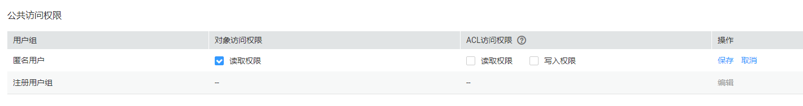

# 应用举例：为匿名用户设置对象的访问权限

## 背景信息

使用OBS存储了大量全球各地的地图数据，这些数据需要对外开放供所有人查阅的。在这种情况下，该公司便可以为这部分数据设置匿名用户的读取权限，然后将这些数据对应的URL公开在英特网上，所有人就可以使用这个URL访问或下载这些公开数据了。

## 配置步骤

1.  创建桶。

    在页面左上角点击“创建桶”，如[图1](#zh-cn_topic_0066088964_fig35806698194939)所示。选择“区域”，选择“存储类别”，输入“桶名称”，并单击“立即创建”。

    **图 1**  创建桶  
    

2.  在“桶列表”中选择新创建的桶，单击“对象”并将需要存储的地图数据作为对象上传至新创建好的桶中。
3.  单击待操作的对象并单击“对象ACL”。
4.  在“对象ACL\>公共访问权限\>匿名用户”中，单击“编辑”为匿名用户设置对象的读取权限，如[图2](#fig58496641194012)所示。

    **图 2**  为匿名用户设置对象的读取权限  
    

5.  单击“保存”保存权限设置。
6.  权限设置成功后单击对象，页面上“链接”显示该对象的共享链接地址。将“链接”中对象对应的URL公布到英特网上。英特网所有用户便可以访问或下载该对象。
7.  匿名用户将对应的URL复制到浏览器，则可以查看到对象。

