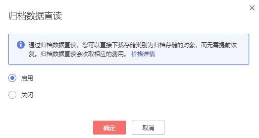

# 归档数据直读

桶开启归档数据直读后，存储类别为归档存储的对象可以直接下载，无需提前恢复。归档数据直读会收取相应的费用，详见[产品价格详情](https://www.huaweicloud.com/pricing.html?tab=detail#/obs)。

您可以在创建桶时开启归档数据直读，详情请见[创建桶](创建桶.md)；也可以在已创建的桶中根据需要开启归档数据直读，详细操作步骤如下。

> **说明：**   
>当前归档数据直读功能仅在以下区域开放：华北-北京一、华北-北京三、华北-北京四、华东-上海一、华东-上海二、华南-广州、华南-深圳、西南-贵阳一。  

## 操作步骤

1.  在OBS管理控制台左侧导航栏选择“对象存储“。
2.  在桶列表单击待操作的桶，进入“概览”页面。
3.  在“基础配置”下，单击“归档数据直读”卡片，系统弹出“归档数据直读”对话框。
4.  选择“开启”。

    **图 1**  开启归档数据直读  
    

5.  单击“确定”。

