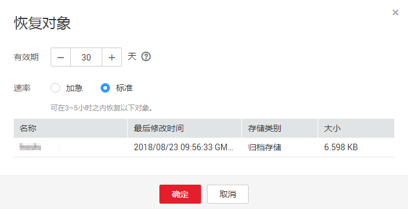

# 恢复归档存储文件

对于存储了类别为归档存的对象，用户需要先恢复才能下载、通过对象URL访问对象、配置对象的ACL权限、设置对象元数据。

数据恢复时间和收费详情请参见[产品价格详情](https://support.huaweicloud.com/pro_price/index.html#obs_detail)。

## 约束与限制

-   归档存储的对象正在恢复的过程中，不允许暂停或删除恢复任务。
-   对象的恢复状态为恢复中时，对象不能再次恢复。

## 操作步骤

1.  在OBS管理控制台桶列表中，单击待操作的桶，进入“概览”页面。
2.  在左侧导航栏，单击“对象”。
3.  选中待恢复的文件，并单击右侧的“恢复”。系统弹出如[图1](#fig37793164192736)所示对话框。

    也可以选中多个文件，单击文件列表上方的“恢复”恢复多个文件。

    > **说明：**   
    >恢复中的对象不能加入批量恢复文件中。  

    **图 1**  恢复对象  
    

4.  恢复对象需要设置对象的有效期和恢复速率，参数解释如下表所示：

    **表 1**  恢复对象

    
    <table><thead align="left"><tr id="row20202933164622"><th class="cellrowborder" valign="top" width="23.68%" id="mcps1.2.3.1.1">
参数

    </th>
    <th class="cellrowborder" valign="top" width="76.32%" id="mcps1.2.3.1.2">
说明

    </th>
    </tr>
    </thead>
    <tbody><tr id="row63287564164622"><td class="cellrowborder" valign="top" width="23.68%" headers="mcps1.2.3.1.1 ">
有效期

    </td>
    <td class="cellrowborder" valign="top" width="76.32%" headers="mcps1.2.3.1.2 ">
对象恢复后，保持为“已恢复”状态的时长，从对象恢复完成开始计时。有效期时长可设置1-30天的整数。系统默认有效期为30天。

    
例如：恢复对象时，有效期设置为20天，则从对象恢复成功后开始算起，20天后，该对象则会从“已恢复”状态变成“未恢复”状态。

    </td>
    </tr>
    <tr id="row53182611164622"><td class="cellrowborder" valign="top" width="23.68%" headers="mcps1.2.3.1.1 ">
速率

    </td>
    <td class="cellrowborder" valign="top" width="76.32%" headers="mcps1.2.3.1.2 ">
对象的恢复速度。

    <ul id="ul20730162164622"><li>加急：可在1-5分钟内恢复归档存储数据。</li><li>标准：可在3-5小时内恢复归档存储数据。</li></ul>
    </td>
    </tr>
    </tbody>
    </table>

5.  单击“确定”。

    对象恢复状态可在对象列表中查看。

    单击页面右上角的“刷新”按钮可手动刷新恢复任务状态。

    > **说明：**   
    >系统每天会在UTC 00:00点检查一次文件恢复情况，过期时间是根据最近一次系统检查时间开始计算的。  

## 相关操作

在对象有效期内，用户可以重复做对象恢复操作。对象的有效期会根据最新一次的恢复完成时间开始算起，以此可以达到延长对象有效期的目的。

> **说明：**   
>重复恢复对象时，其过期时间应该在上一次恢复对象的过期时间之后。  

