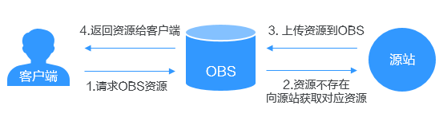
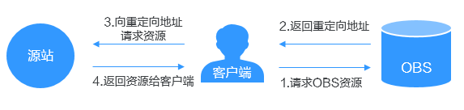
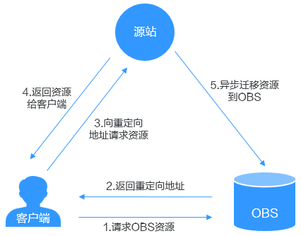

# 数据回源简介

一般情况下，当客户端访问OBS时，如果OBS中没有被访问的数据，将会返回404错误。OBS提供数据回源功能，可以在被请求的数据不存在时，通过回源规则从源站获取对应数据。回源方式支持镜像回源和重定向回源。

## 镜像回源

用户为桶定义镜像回源规则后，如果客户端访问OBS桶中不存在的资源，且该资源符合镜像回源规则，OBS将以镜像回源的方式去数据源站获取资源，将该资源上传到OBS中并返回给客户端。整个过程不中断业务，适用于客户源站无缝迁移数据到OBS，用户可以在无感知的情况下，低成本地迁移业务到OBS上来。镜像回源流程如[图1](#fig8517161311401)所示。

**图 1**  镜像回源流程  

**约束与限制**

-   不支持匿名用户配置镜像回源规则。

-   不支持给并行文件系统配置镜像回源规则。
-   不支持OBS静态网站，即通过OBS静态网站域名下载对象出现404，不会触发镜像回源规则。
-   不支持在镜像回源规则中指定当前OBS桶域名，即源桶与目标桶不能是同一个桶。
-   不支持私有桶的镜像回源，请将源桶设置为公共读。
-   不支持源站使用Transfer-Encoding: chunked方式传输数据，即从源站下载对象的响应中必须包含Content-Length头域来指明源对象大小。
-   不允许多条镜像回源规则配置的文件名前缀存在相互包含或重叠的关系，即对同一个对象的请求不能同时匹配两条镜像回源规则。
-   如果一个请求同时满足镜像回源规则和重定向回源规则，OBS先执行镜像回源流程，若源站没有该对象，则再执行重定向回源流程。
-   仅桶版本号为3.0及以上的桶支持镜像回源。
-   修改镜像回源规则，需要5分钟之后才能生效。
-   最多创建10条镜像回源规则。
-   镜像回源暂时不收费。

## 重定向回源

用户为桶定义重定向回源规则后，如果客户端访问OBS桶中不存在的资源，且该资源符合重定向回源规则，OBS会返回3xx重定向，将请求重定向至第三方数据源站，最终由源站将资源返回给客户端。重定向回源流程如[图2](#fig6082557216615)所示。

**图 2**  重定向回源流程  

在此基础上，OBS提供重定向回源+异步迁移方案，在重定向后将数据异步迁移到OBS桶中，用户下次访问该数据时则会直接从OBS桶中访问，不用再重定向到源站请求数据。适用于以下场景：源站有热点数据不断生成，需要迁移热点数据到OBS桶中。异步迁移流程如[图3](#fig528415411926)所示。

**图 3**  异步迁移流程  

**约束与限制**

-   不支持多版本对象迁移。
-   不支持加密对象的回源和迁移。

-   不支持给并行文件系统配置重定向回源规则。
-   不允许多条重定向回源规则配置的文件名前缀存在相互包含或重叠的关系，即对同一个对象的请求不能同时匹配两条重定向回源规则。
-   如果一个请求同时满足镜像回源规则和重定向回源规则，OBS先执行镜像回源流程，若源站没有该对象，则再执行重定向回源流程。
-   源站桶的对象删除或者有更新，目标OBS桶内的对象不能同步更新。
-   仅桶版本号为3.0及以上的桶支持重定向回源。
-   最多创建5条重定向回源规则。

