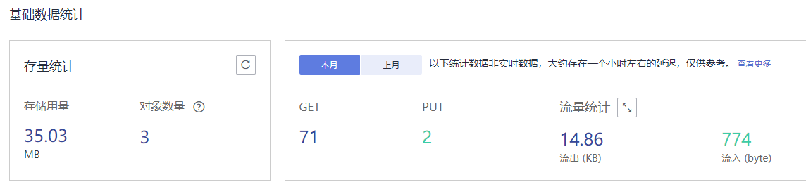
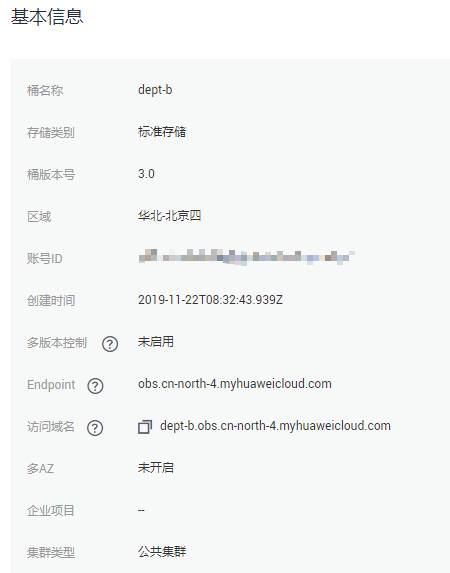

# 查看桶的信息

您可以通过OBS管理控制台直接查看桶的信息，包括基础数据统计和基本信息。。

## 操作步骤

1.  在OBS管理控制台左侧导航栏选择“对象存储“。
2.  在桶列表单击待操作的桶，进入“概览”页面。
3.  在“基础数据统计”下查看桶的存量信息、请求次数和流入/流出流量，如[图1](#fig2848684117471)所示。

    **图 1**  桶的基础数据统计  
    

    请求次数和流量统计的时间范围为本月和上月。

    **表 1**  桶的基础数据统计参数说明

    
    <table><thead align="left"><tr id="row135142612570"><th class="cellrowborder" valign="top" width="28.999999999999996%" id="mcps1.2.3.1.1">
参数

    </th>
    <th class="cellrowborder" valign="top" width="71%" id="mcps1.2.3.1.2">
说明

    </th>
    </tr>
    </thead>
    <tbody><tr id="row335362611573"><td class="cellrowborder" valign="top" width="28.999999999999996%" headers="mcps1.2.3.1.1 ">
存储用量

    </td>
    <td class="cellrowborder" valign="top" width="71%" headers="mcps1.2.3.1.2 ">
桶中存储的对象占用的存储空间。

    
桶的存储空间默认情况下是没有配额限制的，您也可以通过设置桶配额来设置桶的存储空间，详情请参见<a href="https://support.huaweicloud.com/api-obs/zh-cn_topic_0100846743.html" target="_blank" rel="noopener noreferrer">设置桶配额</a>。

    </td>
    </tr>
    <tr id="row4356142614579"><td class="cellrowborder" valign="top" width="28.999999999999996%" headers="mcps1.2.3.1.1 ">
对象数量

    </td>
    <td class="cellrowborder" valign="top" width="71%" headers="mcps1.2.3.1.2 ">
桶中存储的对象数量。在多版本控制功能启用的情况下，为最新版本和历史版本对象数量总和。

    </td>
    </tr>
    <tr id="row143591326135715"><td class="cellrowborder" rowspan="2" valign="top" width="28.999999999999996%" headers="mcps1.2.3.1.1 ">
请求次数

    </td>
    <td class="cellrowborder" valign="top" width="71%" headers="mcps1.2.3.1.2 ">
PUT：所选当月时间，向桶及桶中对象发起的PUT/POST/DELETE请求次数。

    </td>
    </tr>
    <tr id="row153601126125711"><td class="cellrowborder" valign="top" headers="mcps1.2.3.1.1 ">
GET：所选当月时间，向桶及桶中对象发起的GET/HEAD/OPTIONS请求次数。

    </td>
    </tr>
    <tr id="row10362172615718"><td class="cellrowborder" rowspan="2" valign="top" width="28.999999999999996%" headers="mcps1.2.3.1.1 ">
流量统计

    </td>
    <td class="cellrowborder" valign="top" width="71%" headers="mcps1.2.3.1.2 ">
流出：所选当月时间，桶的所有流出流量。

    </td>
    </tr>
    <tr id="row1836417267577"><td class="cellrowborder" valign="top" headers="mcps1.2.3.1.1 ">
流入：所选当月时间，桶的所有流入流量。

    </td>
    </tr>
    </tbody>
    </table>

    > **说明：**   
    >以上统计数据非实时数据，大约存在一个小时左右的延迟，仅供参考。  

4.  在“基本信息”下查看桶的基本信息，如[图2](#fig4178468919236)所示。

    **图 2**  桶的基本信息  
    

    **表 2**  桶信息参数说明

    
    <table><thead align="left"><tr id="row17234060"><th class="cellrowborder" valign="top" width="27%" id="mcps1.2.3.1.1">
参数

    </th>
    <th class="cellrowborder" valign="top" width="73%" id="mcps1.2.3.1.2">
说明

    </th>
    </tr>
    </thead>
    <tbody><tr id="row54972569161944"><td class="cellrowborder" valign="top" width="27%" headers="mcps1.2.3.1.1 ">
桶名称

    </td>
    <td class="cellrowborder" valign="top" width="73%" headers="mcps1.2.3.1.2 ">
桶的名称。

    </td>
    </tr>
    <tr id="row2980605"><td class="cellrowborder" valign="top" width="27%" headers="mcps1.2.3.1.1 ">
存储类别

    </td>
    <td class="cellrowborder" valign="top" width="73%" headers="mcps1.2.3.1.2 ">
桶的存储类别，有标准存储、低频访问存储、归档存储三种类别。

    </td>
    </tr>
    <tr id="row5013506492057"><td class="cellrowborder" valign="top" width="27%" headers="mcps1.2.3.1.1 ">
桶版本号

    </td>
    <td class="cellrowborder" valign="top" width="73%" headers="mcps1.2.3.1.2 ">
桶的版本号。

    </td>
    </tr>
    <tr id="row2643712415712"><td class="cellrowborder" valign="top" width="27%" headers="mcps1.2.3.1.1 ">
区域

    </td>
    <td class="cellrowborder" valign="top" width="73%" headers="mcps1.2.3.1.2 ">
桶所在的区域。

    </td>
    </tr>
    <tr id="row64708738162040"><td class="cellrowborder" valign="top" width="27%" headers="mcps1.2.3.1.1 ">
拥有者

    </td>
    <td class="cellrowborder" valign="top" width="73%" headers="mcps1.2.3.1.2 ">
拥有者是指创建桶的账户。

    </td>
    </tr>
    <tr id="row42411395"><td class="cellrowborder" valign="top" width="27%" headers="mcps1.2.3.1.1 ">
账号ID

    </td>
    <td class="cellrowborder" valign="top" width="73%" headers="mcps1.2.3.1.2 ">
桶的拥有者全局唯一标识，与“我的凭证”页面的“账号ID”相同。

    </td>
    </tr>
    <tr id="row48992040"><td class="cellrowborder" valign="top" width="27%" headers="mcps1.2.3.1.1 ">
创建时间

    </td>
    <td class="cellrowborder" valign="top" width="73%" headers="mcps1.2.3.1.2 ">
桶的创建时间。

    </td>
    </tr>
    <tr id="row015713406208"><td class="cellrowborder" valign="top" width="27%" headers="mcps1.2.3.1.1 ">
多版本控制

    </td>
    <td class="cellrowborder" valign="top" width="73%" headers="mcps1.2.3.1.2 ">
多版本控制的状态。

    </td>
    </tr>
    <tr id="row43167051153945"><td class="cellrowborder" valign="top" width="27%" headers="mcps1.2.3.1.1 ">
Endpoint

    </td>
    <td class="cellrowborder" valign="top" width="73%" headers="mcps1.2.3.1.2 ">
桶所在区域的终端节点。OBS为每个区域提供一个终端节点，终端节点可以理解为OBS在不同区域的区域域名，用于处理各自区域的访问请求。

    </td>
    </tr>
    <tr id="row3949727593952"><td class="cellrowborder" valign="top" width="27%" headers="mcps1.2.3.1.1 ">
访问域名

    </td>
    <td class="cellrowborder" valign="top" width="73%" headers="mcps1.2.3.1.2 ">
OBS会为每一个桶分配默认的访问域名。访问域名是桶在互联网中的域名地址，可应用于直接通过域名访问桶的场景，比如：云应用开发、数据分享等。

    
格式：<i>BucketName</i>.<i>Endpoint</i>

    </td>
    </tr>
    <tr id="row2682181510713"><td class="cellrowborder" valign="top" width="27%" headers="mcps1.2.3.1.1 ">
多AZ

    </td>
    <td class="cellrowborder" valign="top" width="73%" headers="mcps1.2.3.1.2 ">
多AZ功能的状态。

    
开启多AZ后，数据冗余存储至多个AZ中。

    </td>
    </tr>
    </tbody>
    </table>

