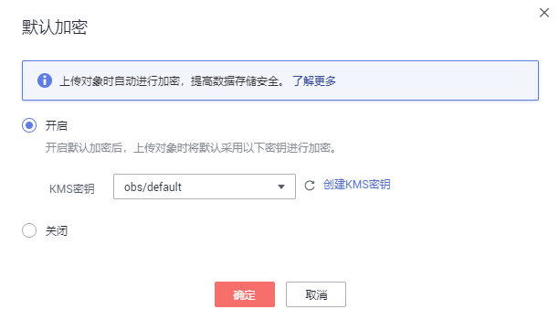

# 桶KMS加密

OBS支持为桶进行服务端加密，加密后，上传到桶中的对象都会被加密。您可以在创建桶时开启KMS加密，详情请见[创建桶](创建桶.md)；也可以在已创建的桶中根据需要开启KMS加密，详细操作步骤如下。

## 操作步骤

1.  在OBS管理控制台左侧导航栏选择“对象存储“。
2.  在桶列表单击待操作的桶，进入“概览”页面。
3.  在“基础配置”下，单击“默认加密”卡片，系统弹出“默认加密”对话框。
4.  选择“开启”。

    开启“KMS加密”后，KMS密钥会默认选中“obs/default”。您也可以通过单击“创建KMS密钥”进入数据加密服务页面创建自定义密钥，然后通过KMS密钥的下拉框选中您创建的KMS密钥。

    **图 1**  开启桶KMS加密  
    

5.  单击“确定”。

