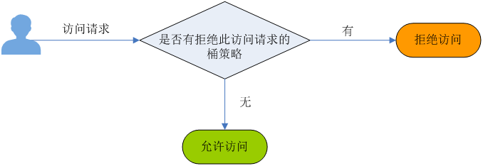

# 桶策略简介

除了桶ACL外，桶的拥有者还可以通过编写桶策略（Bucket Policy）设置桶的访问权限。桶的拥有者可通过同一策略对某桶内任意数量的对象进行权限设置。设置桶策略后，后续对该桶的访问请求都将受到桶策略的限制，这种限制表现为接受或拒绝请求。相对于桶ACL，桶策略提供更细粒度的权限控制，并且基于以下参数实现对桶和对象的集中访问控制：

-   效果：指定桶策略是拒绝还是允许访问，详情请参见[桶策略效果](桶策略效果.md)。
-   被授权用户：指定桶策略中作用的用户，详情请参见[桶策略被授权用户](桶策略被授权用户.md)。
-   资源：指定桶策略作用的资源，具体为桶和对象，详情请参见[桶策略资源](桶策略资源.md)。
-   动作：指定桶策略可以执行的操作，桶和对象各自支持一组操作，详情请参见[桶策略动作](桶策略动作.md)。
-   条件：桶策略生效的条件，详情请参见[桶策略条件](桶策略条件.md)。

桶策略由通用设置和高级设置下的桶策略共同组成，都可以基于以上参数转换为具体的效果、被授权用户、资源、动作及条件。

## 通用设置下的桶策略

通用设置提供三种策略供用户直接设置。

-   私有：桶的拥有者拥有完全控制权限，其他用户在未经授权的情况下均无访问权限。
-   公共读：任何用户都可以对桶内对象进行读操作，仅桶的拥有者可以进行写操作。
-   公共读写：任何用户都可以对桶内对象进行读/写/删除操作。

将三种通用策略转换为桶策略参数描述结果如[表1](#table12248152111227)所示。

**表 1**  通用策略描述

<table><thead align="left"><tr id="row15249821152217"><th class="cellrowborder" valign="top" width="19%" id="mcps1.2.5.1.1">
参数

</th>
<th class="cellrowborder" valign="top" width="15%" id="mcps1.2.5.1.2">
私有

</th>
<th class="cellrowborder" valign="top" width="32%" id="mcps1.2.5.1.3">
公共读

</th>
<th class="cellrowborder" valign="top" width="34%" id="mcps1.2.5.1.4">
公共读写

</th>
</tr>
</thead>
<tbody><tr id="row724919215226"><td class="cellrowborder" valign="top" width="19%" headers="mcps1.2.5.1.1 ">
效果

</td>
<td class="cellrowborder" valign="top" width="15%" headers="mcps1.2.5.1.2 ">
无

</td>
<td class="cellrowborder" valign="top" width="32%" headers="mcps1.2.5.1.3 ">
允许

</td>
<td class="cellrowborder" valign="top" width="34%" headers="mcps1.2.5.1.4 ">
允许

</td>
</tr>
<tr id="row1224915215221"><td class="cellrowborder" valign="top" width="19%" headers="mcps1.2.5.1.1 ">
被授权用户

</td>
<td class="cellrowborder" valign="top" width="15%" headers="mcps1.2.5.1.2 ">
无

</td>
<td class="cellrowborder" valign="top" width="32%" headers="mcps1.2.5.1.3 ">
*（任何用户）

</td>
<td class="cellrowborder" valign="top" width="34%" headers="mcps1.2.5.1.4 ">
*（任何用户）

</td>
</tr>
<tr id="row5250121102214"><td class="cellrowborder" valign="top" width="19%" headers="mcps1.2.5.1.1 ">
资源

</td>
<td class="cellrowborder" valign="top" width="15%" headers="mcps1.2.5.1.2 ">
无

</td>
<td class="cellrowborder" valign="top" width="32%" headers="mcps1.2.5.1.3 ">
*（桶内所有对象）

</td>
<td class="cellrowborder" valign="top" width="34%" headers="mcps1.2.5.1.4 ">
*（桶内所有对象）

</td>
</tr>
<tr id="row14250821122214"><td class="cellrowborder" valign="top" width="19%" headers="mcps1.2.5.1.1 ">
动作

</td>
<td class="cellrowborder" valign="top" width="15%" headers="mcps1.2.5.1.2 ">
无

</td>
<td class="cellrowborder" valign="top" width="32%" headers="mcps1.2.5.1.3 "><ul id="ul1512955514"><li>GetObject（获取对象内容及元数据）</li><li>GetObjectVersion（获取指定版本对象内容及元数据）</li></ul>
</td>
<td class="cellrowborder" valign="top" width="34%" headers="mcps1.2.5.1.4 "><ul id="ul5350174995516"><li>GetObject（获取对象内容及元数据）</li><li>GetObjectVersion（获取指定版本对象内容及元数据）</li><li>PutObject（上传对象）</li><li>DeleteObject（删除对象）</li><li>DeleteObjectVersion（删除指定版本对象）</li></ul>
</td>
</tr>
<tr id="row122501121162216"><td class="cellrowborder" valign="top" width="19%" headers="mcps1.2.5.1.1 ">
条件

</td>
<td class="cellrowborder" valign="top" width="15%" headers="mcps1.2.5.1.2 ">
无

</td>
<td class="cellrowborder" valign="top" width="32%" headers="mcps1.2.5.1.3 ">
无

</td>
<td class="cellrowborder" valign="top" width="34%" headers="mcps1.2.5.1.4 ">
无

</td>
</tr>
</tbody>
</table>

> **说明：**   
>-   桶创建成功后，默认桶策略为私有。私有策略限制了仅桶拥有者具有完全控制权限，其他用户在未经授权的情况下均无访问权限。  
>-   为确保数据安全，不推荐用户使用公共读或公共读写，建议使用私有。  

## 高级设置下的桶策略

高级设置下提供三种增加桶策略的方式，方便用户快速设置桶策略。

-   只读模式：被授权用户将拥有桶内指定对象的读权限，对应可以执行获取对象内容及元数据操作。
-   读写模式：被授权用户将拥有桶内指定对象的读写权限，对应可以执行获取对象内容及元数据、上传对象、删除对象等操作。
-   自定义模式：自定义配置被授权用户可以拥有桶或对象的操作权限，由效果、被授权用户、资源、动作和条件5个桶策略基本参数共同决定。

## 桶策略冲突判定

桶策略冲突判定的基本准则为拒绝（Deny）优先。不管是通用设置还是高级设置下的桶策略，都遵循Deny优先的原则。

桶策略高级设置提供更细粒度的权限控制，可以是拒绝访问请求、也可以是允许访问请求，而通用策略只定义允许的情况。因此高级设置在与通用策略产生冲突的情况下，将以高级设置中的桶策略为准。

此处以通用策略为公共读，高级设置中增加一条拒绝被授权用户账号B（云服务账户）执行获取对象列表操作的自定义桶策略为例，演示通用策略和高级设置的判断逻辑。

当账号B请求获取example桶中对象列表时，OBS对此请求的判断逻辑如下：

**图 1**  桶策略冲突时逻辑判定  

由于桶策略中已定义拒绝此用户获取对象列表，虽然通用策略为公共读，允许任何人获取对象列表，但最终的授权结果以高级设置中拒绝账户B获取对象列表的策略为准。

## 桶策略使用场景

如果某账号需要访问OBS桶，可以通过桶ACL授权。如果对IAM用户授权，使用用户权限或桶策略均可。但在以下情况则需要使用桶策略。

-   获取对象内容：桶ACL只能执行获取对象列表、上传对象等操作（请参见[表2](桶ACL简介.md#table28226836)），无法获取对象内容及元数据。想要获取桶内对象的具体内容，则只能使用桶策略（通用策略中的公共读或使用高级设置自定义权限）。
-   跨账户的OBS访问权限管理：桶ACL是基于账号和用户组的权限控制，无法控制某一个IAM用户的权限。而用户权限仅可以控制自己账户下的用户对云资源的操作权限，而不能控制其他账户的用户权限。对于其他账户中IAM用户的跨账户访问OBS权限，必须使用桶策略下的高级设置。
-   OBS所有操作权限管理：从桶ACL与桶策略的映射关系（请参见[表1](桶ACL和桶策略的关系.md#table183716545593)）可以看出，桶ACL仅支持简单的权限控制，例如桶ACL不能授予删除桶策略的权限，而桶策略可以授予删除桶ACL的权限。因此想要管理OBS桶和对象的所有操作权限，只能使用桶策略下的高级设置。

