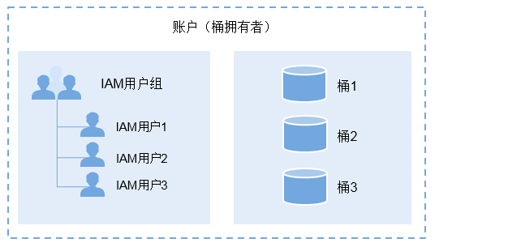

# 概述

桶访问权限由基于资源的桶ACL和桶策略组成。在OBS中，资源主要由桶、对象以及与桶和对象关联的子资源组成。

## OBS资源

桶和对象是访问权限控制的基本资源，桶和对象分别拥有关联的子资源，也可以对其进行访问权限控制。对桶或对象的访问权限控制体现在能否对桶或对象进行读取和写入，而对桶或对象子资源的访问权限控制体现在能否对其进行获取和配置。

桶的子资源包括：

-   **多版本控制**：桶多版本控制的配置信息。
-   **日志记录**：记录桶的访问请求日志的配置信息。
-   **标签**：桶标签的配置信息。
-   **事件通知**：桶事件通知的配置信息。
-   **桶的访问权限**：桶的访问权限配置信息。
-   **生命周期规则**：生命周期配置信息。
-   **静态网站托管**：网站托管的配置信息。
-   **跨域资源共享**：跨域请求配置信息。

对象的子资源包括；

-   **归档存储对象**：恢复归档存储对象的配置信息，包括有效期、恢复速率等信息。
-   **元数据**：对象的元数据信息。
-   **对象ACL**：对象的ACL配置信息。

在桶的访问权限中，桶ACL负责管理桶资源的访问权限。桶策略既可以管理桶资源，也可以管理桶子资源、对象子资源的访问权限。针对不同的资源，桶访问权限提供不同的操作（具体参见[动作](桶策略动作.md)）用以管理来自访问者的请求。

## 桶拥有者

桶拥有者是创建桶的账户。桶拥有者的关系如[图1](#fig19311771115)所示。

**图 1**  桶拥有者  

在账户下创建一个IAM用户，那么该账户为父级拥有者。该IAM用户创建的桶的桶拥有者为改用户的父账户。

## 桶的权限验证

桶的访问权限由基于资源的访问权限（桶ACL和桶策略）和基于IAM的用户权限组成。当OBS收到对桶的操作请求时（作用于桶的操作请参见[与桶相关的动作](桶策略动作.md#section88267409555)），会从用户权限和桶访问权限两方面判断是否具有权限访问OBS桶资源。

1.  **用户权限**：如果请求者是IAM用户，OBS会先验证此IAM用户所属的用户组是否具有OBS资源权限，再判断是否拥有桶的访问权限。如果请求者是账户，则不用判断用户权限。
2.  **桶访问权限**：当IAM用户或账户进入桶后，能够对桶执行的具体操作，则由桶ACL和桶策略共同决定。桶ACL和桶策略判定准则请参见[桶ACL和桶策略的冲突判断](桶ACL和桶策略的关系.md#section06951081503)。

