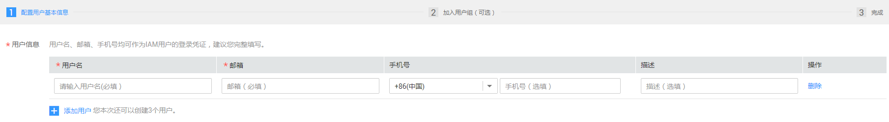
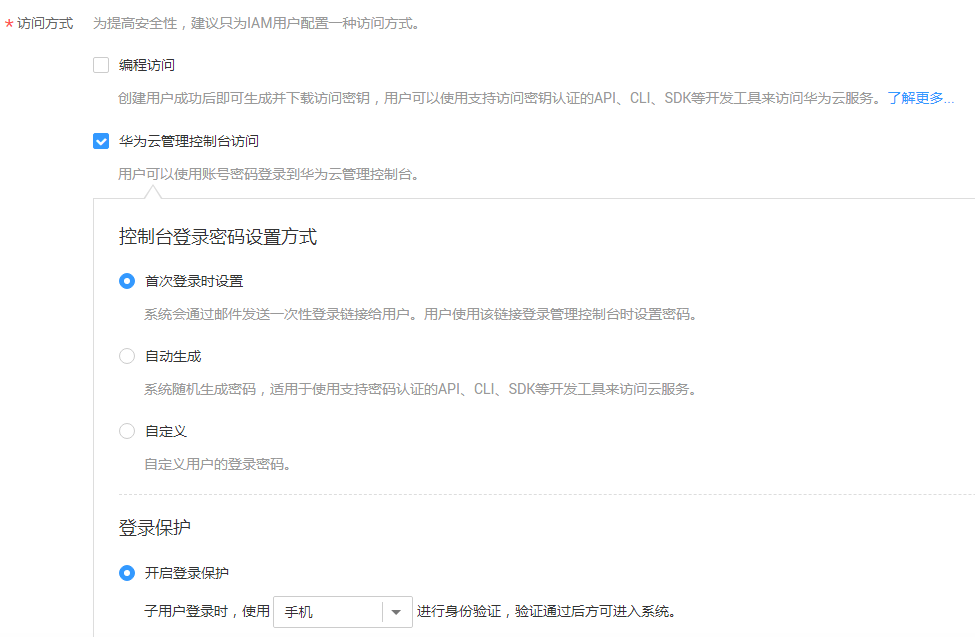

# 设置用户权限

若云服务账号已经能满足您的要求，不需要创建独立的IAM用户，您可以跳过本章节，不影响您使用OBS的其它功能。

若您使用IAM用户，则需要先配置IAM用户的OBS资源权限。OBS与其他云资源是分开部署的。

## 示例流程

为IAM用户授权OBS资源权限的流程如下：

**图 1**  为IAM用户授权OBS资源权限  

## 操作步骤

1.  使用云服务账号登录管理控制台。
2.  在顶部导航栏选择“服务列表\>管理和部署\>统一身份认证服务IAM”，进入“统一身份认证服务”管理控制台。
3.  创建用户组并授予OBS资源权限。

    用户组是用户的集合，IAM通过用户组功能实现用户的授权。您在IAM中创建的用户，需要加入特定用户组后，用户才具备用户组所拥有的权限。

    1.  在左侧导航栏单击“用户组”，进入“用户组”界面。
    2.  单击“创建用户组”。
    3.  在“创建用户组”界面，输入“用户组名称”，单击“确定”。

        用户组创建完成，界面自动返回用户组列表，列表中显示新建的用户组。

    4.  单击新建用户组右侧的“权限配置”，在“用户组权限”页签中，基于“全局服务\>对象存储服务”为用户组授权OBS资源权限。

        与OBS相关的权限介绍，请参见[OBS系统策略](https://support.huaweicloud.com/productdesc-obs/obs_03_0045.html#section0)。

    5.  单击“设置策略”，选中策略名称，单击“确定”完成授权。

        > **说明：**   
        >在“策略内容”中您可以查看到授权的详细信息。  
        >由于缓存的存在，对用户、用户组以及企业项目授予OBS相关的RBAC策略后，大概需要等待13分钟RBAC策略才能生效；授予OBS相关的细粒度策略后，大概需要等待5分钟细粒度策略才能生效。  

4.  创建用户。

    IAM用户与企业中的实际员工或是应用程序相对应，有唯一的安全凭证，可以通过加入一个或多个用户组来获得用户组的权限。关于IAM用户的创建方式请参见如下步骤。

    1.  在左侧导航栏单击“用户”，进入“用户”界面。
    2.  单击“创建用户”。
    3.  在“创建用户”页面填写“用户信息”。如需一次创建多个用户，可以单击“添加用户”进行批量创建，每次最多可创建10个用户。

        **图 2**  填写用户信息  
        

        -   用户名：用户登录华为云的用户名。
        -   邮箱：IAM用户绑定的邮箱，仅“访问方式”选择“首次登录时设置”时必填，选择其他访问方式时选填。
        -   手机号（选填）：IAM用户绑定的手机号。
        -   描述（选填）：对用户的描述信息。

    4.  在“创建用户”页面选择“访问方式”，完成后单击“下一步”。

        **图 3**  设置访问方式  
        

        -   编程访问：创建用户完成后即可下载本次创建的所有用户的[访问密钥](https://support.huaweicloud.com/usermanual-ca/zh-cn_topic_0046606340.html)。
        -   华为云管理控制台访问：用户可以使用账号密码登录到华为云管理控制台。
            1.  控制台登录密码设置方式：当一次创建多个用户时，密码设置方式可选择“首次登录时设置”和“自定义”，不支持“自动生成”密码；当仅创建一个用户时，以上方式均可选择。
            2.  登录保护：为了您的账号安全，建议选择“开启登录保护”。后续如需开启或关闭登录保护，请参见：[登录保护](https://support.huaweicloud.com/usermanual-iam/zh-cn_topic_0079477316.html)。

    5.  （可选）将用户加入到用户组，完成后单击“下一步”。
        -   选择新创建的用户组。将用户加入用户组，用户将具备用户组的权限，这一过程即给该用户授权。其中“admin”为系统缺省提供的用户组，具有管理人员以及所有云服务资源的操作权限。
        -   如需创建新的用户组，可单击“创建用户组”，填写用户组名称和描述（可选），创建成功后即可将用户加入到新创建的用户组中。

    6.  IAM用户创建成功，用户列表中显示新创建的IAM用户。如果在访问方式中勾选了“编程访问”，可在此页面下载访问密钥，后续也可以在“我的凭证”中[管理访问密钥](https://support.huaweicloud.com/usermanual-ca/zh-cn_topic_0046606340.html)。

5.  使用IAM用户登录OBS管理控制台，验证用户权限。

