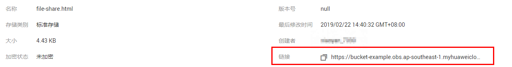

# 通过对象URL访问对象

将对象权限设置为匿名用户读取权限，通过分享对象URL，匿名用户通过分享的链接地址可访问对象数据。

## 前提条件

已经设置匿名用户对该对象的读取权限。权限开启方法请参见[为匿名用户设置对象的访问权限](为匿名用户设置对象的访问权限.md)。

> **说明：**   
>不能对已加密的对象进行共享。  

## 操作步骤

1.  在OBS管理控制台左侧导航栏选择“对象存储“。
2.  在桶列表单击待操作的桶，进入“概览”页面。
3.  在左侧导航栏，单击“对象”。
4.  单击待共享对象，在网页上方显示对象的信息。“链接”显示该对象的共享链接地址，如[图1](#fig36534596192426)所示。

    匿名用户单击该链接地址即可通过浏览器访问该对象。对象链接地址格式为：https://_桶名_._域名_/_文件夹目录层级_/_对象名_。如果该对象存在于桶的根目录下，其链接地址将不会有文件夹目录层级。

    **图 1**  对象链接  
    

    > **说明：**   
    >-   对于存储类别为归档存储的对象，如果要让匿名用户通过URL访问，则需要先确认对象的状态是否为“已恢复”。  
    >-   对象类型不同，通过浏览器访问该对象的方式不同。例如：.txt、.html等文件可直接通过浏览器打开浏览，而.exe、.dat等文件则会在浏览器打开时，自动下载到本地。  

