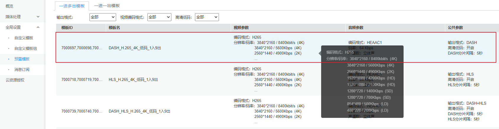
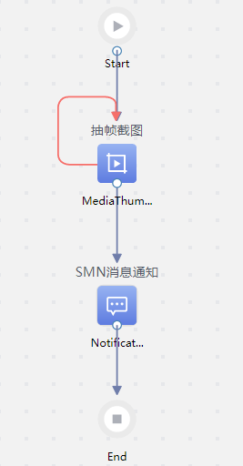
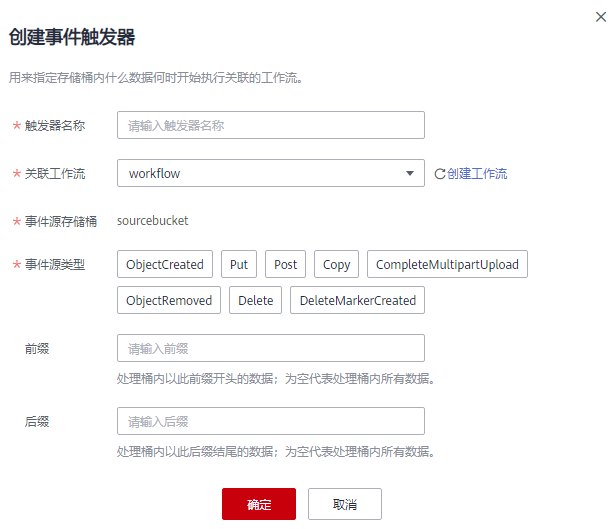

# 配置Data+

## 操作场景

当需要使用OBS提供的Data+服务对OBS内存储的数据，自动进行多项复杂任务（如解析、转码、截图等）处理时，可按照本节指导进行配置。

1.  您需要先[创建工作流](#section34825242413)，工作流可以自定义任务处理流程。
2.  再为工作流[创建事件触发器](#section187831529172915)，事件触发器为工作流设置执行条件，指定桶内什么数据在执行某类操作后开始执行工作流。

## 约束与限制

请参见[Data+简介](Data+简介.md)。

## 创建工作流

1.  在OBS管理控制台左侧导航栏选择“对象存储“。
2.  在桶列表单击待操作的桶，进入“概览”页面。
3.  在左侧导航栏选中“Data+”，进入“事件触发器”页面。
4.  单击列表上方的“创建工作流”，进入“工作流”页面。
5.  单击界面右上角的“创建工作流”，进入“工作流编排”页面。
6.  将左侧预置的模板或自定义的函数拖拽至编排区域，同时在右侧属性面板配置基本属性和动态参数，配置完成后图标将由白色填充变为蓝色填充。

    Data+目前提供三种视频处理模板（视频解析、抽帧截图、媒资转码）和一种消息通知模板（SMN消息通知），同时也支持事件延迟和用户自定义函数，满足用户的各种定制需求。

    -   视频解析

        模板作用：用于新建视频解析任务，以解析视频元数据。该模板实际调用的是MPC服务的[新建视频解析任务接口](https://support.huaweicloud.com/api-mpc/mpc_04_0061.html)。

        **表 1**  视频解析属性配置说明

        
        <table><thead align="left"><tr id="row16358172654115"><th class="cellrowborder" valign="top" width="15%" id="mcps1.2.4.1.1">
属性类别

        </th>
        <th class="cellrowborder" valign="top" width="25%" id="mcps1.2.4.1.2">
参数名称

        </th>
        <th class="cellrowborder" valign="top" width="60%" id="mcps1.2.4.1.3">
参数说明

        </th>
        </tr>
        </thead>
        <tbody><tr id="row1435812266412"><td class="cellrowborder" rowspan="4" valign="top" width="15%" headers="mcps1.2.4.1.1 ">
基本属性

        </td>
        <td class="cellrowborder" valign="top" width="25%" headers="mcps1.2.4.1.2 ">
名称

        </td>
        <td class="cellrowborder" valign="top" width="60%" headers="mcps1.2.4.1.3 ">
任务的名称，修改后将体现在工作流编排区域。

        <ul id="ul1186594422410"><li>必须以字母或数字开头</li><li>只能由字母、数字、下划线和中划线组成</li><li>长度范围为1~20个字符</li><li>不能和同一工作流中的其他任务重名</li></ul>
        </td>
        </tr>
        <tr id="row15358112644113"><td class="cellrowborder" valign="top" headers="mcps1.2.4.1.1 ">
超时(秒)

        </td>
        <td class="cellrowborder" valign="top" headers="mcps1.2.4.1.2 ">
任务超时时间，即任务执行的最长时间。

        
支持设置0~300秒的超时时间，如果设置为0，则表示超时时间为默认值30秒。

        </td>
        </tr>
        <tr id="row93584268412"><td class="cellrowborder" valign="top" headers="mcps1.2.4.1.1 ">
动作提供方

        </td>
        <td class="cellrowborder" valign="top" headers="mcps1.2.4.1.2 ">
函数模板的提供方。

        </td>
        </tr>
        <tr id="row3358926124116"><td class="cellrowborder" valign="top" headers="mcps1.2.4.1.1 ">
错误处理

        </td>
        <td class="cellrowborder" valign="top" headers="mcps1.2.4.1.2 ">
可定义不同类型错误发生时的重试次数、重试间隔，以及重试失败后跳转到的目标任务。

        
错误类型包括：匹配所有、执行失败、权限不合法、参数不合法、函数不存在、请求太频繁、函数不可用、函数异常

        </td>
        </tr>
        <tr id="row14358102618419"><td class="cellrowborder" valign="top" width="15%" headers="mcps1.2.4.1.1 ">
动态参数

        </td>
        <td class="cellrowborder" valign="top" width="25%" headers="mcps1.2.4.1.2 ">
视频解析同步处理

        </td>
        <td class="cellrowborder" valign="top" width="60%" headers="mcps1.2.4.1.3 ">
是否同步处理，只能为0或1。

        <ul id="ul1865415376472"><li>0：排队处理。查询后仅返回任务ID，还需进一步调用<a href="https://support.huaweicloud.com/api-mpc/mpc_04_0062.html" target="_blank" rel="noopener noreferrer">查询视频解析任务接口</a>才能获取到视频元数据。</li><li>1：同步处理。查询后将直接返回视频元数据。</li></ul>
        </td>
        </tr>
        </tbody>
        </table>

    -   **抽帧截图**

        模板作用：用于新建视频截图任务，截取视频第2秒的图片。该模板实际调用的是MPC服务的[新建截图任务接口](https://support.huaweicloud.com/api-mpc/mpc_04_0034.html)。

        **表 2**  抽帧截图属性配置说明

        
        <table><thead align="left"><tr id="row189655210522"><th class="cellrowborder" valign="top" width="15%" id="mcps1.2.4.1.1">
属性类别

        </th>
        <th class="cellrowborder" valign="top" width="25%" id="mcps1.2.4.1.2">
参数名称

        </th>
        <th class="cellrowborder" valign="top" width="60%" id="mcps1.2.4.1.3">
参数说明

        </th>
        </tr>
        </thead>
        <tbody><tr id="row119655212525"><td class="cellrowborder" rowspan="4" valign="top" width="15%" headers="mcps1.2.4.1.1 ">
基本属性

        </td>
        <td class="cellrowborder" valign="top" width="25%" headers="mcps1.2.4.1.2 ">
名称

        </td>
        <td class="cellrowborder" valign="top" width="60%" headers="mcps1.2.4.1.3 ">
任务的名称，修改后将体现在工作流编排区域。

        <ul id="ul1661574918244"><li>必须以字母或数字开头</li><li>只能由字母、数字、下划线和中划线组成</li><li>长度范围为1~20个字符</li><li>不能和同一工作流中的其他任务重名</li></ul>
        </td>
        </tr>
        <tr id="row18965124526"><td class="cellrowborder" valign="top" headers="mcps1.2.4.1.1 ">
超时(秒)

        </td>
        <td class="cellrowborder" valign="top" headers="mcps1.2.4.1.2 ">
任务超时时间，即任务执行的最长时间。

        
支持设置0~300秒的超时时间，如果设置为0，则表示超时时间为默认值30秒。

        </td>
        </tr>
        <tr id="row1965628521"><td class="cellrowborder" valign="top" headers="mcps1.2.4.1.1 ">
动作提供方

        </td>
        <td class="cellrowborder" valign="top" headers="mcps1.2.4.1.2 ">
函数模板的提供方。

        </td>
        </tr>
        <tr id="row109651628528"><td class="cellrowborder" valign="top" headers="mcps1.2.4.1.1 ">
错误处理

        </td>
        <td class="cellrowborder" valign="top" headers="mcps1.2.4.1.2 ">
可定义不同类型错误发生时的重试次数、重试间隔，以及重试失败后跳转到的目标任务。

        
错误类型包括：匹配所有、执行失败、权限不合法、参数不合法、函数不存在、请求太频繁、函数不可用、函数异常

        </td>
        </tr>
        <tr id="row1996522105210"><td class="cellrowborder" rowspan="2" valign="top" width="15%" headers="mcps1.2.4.1.1 ">
动态参数

        </td>
        <td class="cellrowborder" valign="top" width="25%" headers="mcps1.2.4.1.2 ">
视频截图输出桶

        </td>
        <td class="cellrowborder" valign="top" width="60%" headers="mcps1.2.4.1.3 ">
使用MPC服务进行视频截图后，用于保存截图的OBS桶名。

        
输出桶需要和Data+工作流在同一区域，工作流所属区域为创建工作流的桶所属区域。例如工作流A是在桶A中创建的，则桶A的区域即为工作流A的区域。

        </td>
        </tr>
        <tr id="row1844720290433"><td class="cellrowborder" valign="top" headers="mcps1.2.4.1.1 ">
视频截图输出路径

        </td>
        <td class="cellrowborder" valign="top" headers="mcps1.2.4.1.2 ">
视频截图输出桶中存放视频截图的OBS桶的具体路径。

        
例如：输入abc或abc/，均表示截图存放在abc文件夹下，如果文件夹不存在，会自动新建。输出路径为空表示存放在桶的根目录。

        </td>
        </tr>
        </tbody>
        </table>

    -   **媒资转码**

        模板作用：执行MPC服务的预置转码模板“DASH\_H.265\_4K\_低码\_1入9出”，将片源转为4K、2K、1080等码率的视频。该模板实际调用的是MPC服务的[新建转码任务接口](https://support.huaweicloud.com/api-mpc/mpc_04_0017.html)。

        **图 1**  转码模板  
        

        **表 3**  媒资转码属性配置说明

        
        <table><thead align="left"><tr id="row434713855217"><th class="cellrowborder" valign="top" width="15%" id="mcps1.2.4.1.1">
属性类别

        </th>
        <th class="cellrowborder" valign="top" width="25%" id="mcps1.2.4.1.2">
参数名称

        </th>
        <th class="cellrowborder" valign="top" width="60%" id="mcps1.2.4.1.3">
参数说明

        </th>
        </tr>
        </thead>
        <tbody><tr id="row133483818522"><td class="cellrowborder" rowspan="4" valign="top" width="15%" headers="mcps1.2.4.1.1 ">
基本属性

        </td>
        <td class="cellrowborder" valign="top" width="25%" headers="mcps1.2.4.1.2 ">
名称

        </td>
        <td class="cellrowborder" valign="top" width="60%" headers="mcps1.2.4.1.3 ">
任务的名称，修改后将体现在工作流编排区域。

        <ul id="ul14715163599"><li>必须以字母或数字开头</li><li>只能由字母、数字、下划线和中划线组成</li><li>长度范围为1~20个字符</li><li>不能和同一工作流中的其他任务重名</li></ul>
        </td>
        </tr>
        <tr id="row1034868205211"><td class="cellrowborder" valign="top" headers="mcps1.2.4.1.1 ">
超时(秒)

        </td>
        <td class="cellrowborder" valign="top" headers="mcps1.2.4.1.2 ">
任务超时时间，即任务执行的最长时间。

        
支持设置0~300秒的超时时间，如果设置为0，则表示超时时间为默认值30秒。

        </td>
        </tr>
        <tr id="row134810819526"><td class="cellrowborder" valign="top" headers="mcps1.2.4.1.1 ">
动作提供方

        </td>
        <td class="cellrowborder" valign="top" headers="mcps1.2.4.1.2 ">
函数模板的提供方。

        </td>
        </tr>
        <tr id="row103486811524"><td class="cellrowborder" valign="top" headers="mcps1.2.4.1.1 ">
错误处理

        </td>
        <td class="cellrowborder" valign="top" headers="mcps1.2.4.1.2 ">
可定义不同类型错误发生时的重试次数、重试间隔，以及重试失败后跳转到的目标任务。

        
错误类型包括：匹配所有、执行失败、权限不合法、参数不合法、函数不存在、请求太频繁、函数不可用、函数异常

        </td>
        </tr>
        <tr id="row1434811835216"><td class="cellrowborder" rowspan="2" valign="top" width="15%" headers="mcps1.2.4.1.1 ">
动态参数

        </td>
        <td class="cellrowborder" valign="top" width="25%" headers="mcps1.2.4.1.2 ">
视频转码输出桶

        </td>
        <td class="cellrowborder" valign="top" width="60%" headers="mcps1.2.4.1.3 ">
使用MPC服务进行媒资转码后，用于保存转码后视频文件的OBS桶名。

        
输出桶需要和Data+工作流在同一区域，工作流所属区域为创建工作流的桶所属区域。例如工作流A是在桶A中创建的，则桶A的区域即为工作流A的区域。

        </td>
        </tr>
        <tr id="row142101952163317"><td class="cellrowborder" valign="top" headers="mcps1.2.4.1.1 ">
视频转码输出路径

        </td>
        <td class="cellrowborder" valign="top" headers="mcps1.2.4.1.2 ">
视频转码输出桶中存放转码后视频文件的OBS桶的具体路径。

        
例如：输入abc或abc/，均表示截图存放在abc文件夹下，如果文件夹不存在，会自动新建。输出路径为空表示存放在桶的根目录。

        </td>
        </tr>
        </tbody>
        </table>

    -   **SMN消息通知**

        模板作用：可用于在执行某项任务后，向SMN主题的订阅者发送通知。您可以在工作流的任意位置添加SMN消息通知，将上一个函数的执行结果发送给订阅者。

        **表 4**  SMN消息通知属性配置说明

        
        <table><thead align="left"><tr id="row09081012115218"><th class="cellrowborder" valign="top" width="15%" id="mcps1.2.4.1.1">
属性类别

        </th>
        <th class="cellrowborder" valign="top" width="25%" id="mcps1.2.4.1.2">
参数名称

        </th>
        <th class="cellrowborder" valign="top" width="60%" id="mcps1.2.4.1.3">
参数说明

        </th>
        </tr>
        </thead>
        <tbody><tr id="row109081712105213"><td class="cellrowborder" rowspan="4" valign="top" width="15%" headers="mcps1.2.4.1.1 ">
基本属性

        </td>
        <td class="cellrowborder" valign="top" width="25%" headers="mcps1.2.4.1.2 ">
名称

        </td>
        <td class="cellrowborder" valign="top" width="60%" headers="mcps1.2.4.1.3 ">
任务的名称，修改后将体现在工作流编排区域。

        <ul id="ul7861112355919"><li>必须以字母或数字开头</li><li>只能由字母、数字、下划线和中划线组成</li><li>长度范围为1~20个字符</li><li>不能和同一工作流中的其他任务重名</li></ul>
        </td>
        </tr>
        <tr id="row139081012155212"><td class="cellrowborder" valign="top" headers="mcps1.2.4.1.1 ">
超时(秒)

        </td>
        <td class="cellrowborder" valign="top" headers="mcps1.2.4.1.2 ">
任务超时时间，即任务执行的最长时间。

        
支持设置0~300秒的超时时间，如果设置为0，则表示超时时间为默认值30秒。

        </td>
        </tr>
        <tr id="row6908712115212"><td class="cellrowborder" valign="top" headers="mcps1.2.4.1.1 ">
动作提供方

        </td>
        <td class="cellrowborder" valign="top" headers="mcps1.2.4.1.2 ">
函数模板的提供方。

        </td>
        </tr>
        <tr id="row590810124526"><td class="cellrowborder" valign="top" headers="mcps1.2.4.1.1 ">
错误处理

        </td>
        <td class="cellrowborder" valign="top" headers="mcps1.2.4.1.2 ">
可定义不同类型错误发生时的重试次数、重试间隔，以及重试失败后跳转到的目标任务。

        
错误类型包括：匹配所有、执行失败、权限不合法、参数不合法、函数不存在、请求太频繁、函数不可用、函数异常

        </td>
        </tr>
        <tr id="row29081125524"><td class="cellrowborder" rowspan="2" valign="top" width="15%" headers="mcps1.2.4.1.1 ">
动态参数

        </td>
        <td class="cellrowborder" valign="top" width="25%" headers="mcps1.2.4.1.2 ">
SMN topic唯一标识

        </td>
        <td class="cellrowborder" valign="top" width="60%" headers="mcps1.2.4.1.3 ">
选择已授权给OBS发布消息的SMN主题，以便向主题订阅者发送消息。SMN主题需通过SMN页面创建。

        
SMN服务的操作指导请参见《消息通知服务用户指南》中“<a href="https://support.huaweicloud.com/usermanual-smn/zh-cn_topic_0043961401.html" target="_blank" rel="noopener noreferrer">创建主题</a>”、“<a href="https://support.huaweicloud.com/usermanual-smn/zh-cn_topic_0043394891.html" target="_blank" rel="noopener noreferrer">设置主题策略</a>”和“<a href="https://support.huaweicloud.com/usermanual-smn/zh-cn_topic_0043961402.html" target="_blank" rel="noopener noreferrer">订阅主题</a>”章节的内容。

        
 说明： 

SMN主题配置成功后，请不要随意删除与OBS Data+工作流相关联的主题，也不要取消主题对OBS的授权。若与OBS Data+工作流相关联的主题被删除或取消该主题对OBS的授权，可能会导致对应主题的订阅者无法收到消息。

        

        
下拉列表中仅展示与Data+工作流同区域且同项目的SMN主题。工作流所属区域为创建工作流的桶所属区域。例如工作流A是在桶A中创建的，则桶A的区域即为工作流A的区域。

        </td>
        </tr>
        <tr id="row8863213517"><td class="cellrowborder" valign="top" headers="mcps1.2.4.1.1 ">
SMN topic主题名称

        </td>
        <td class="cellrowborder" valign="top" headers="mcps1.2.4.1.2 ">
发布消息的标题，给邮箱订阅者发送邮件时作为邮件主题。

        </td>
        </tr>
        </tbody>
        </table>

    -   **事件延迟**

        模板作用：可用于控制工作流两个相邻任务间的等待时长，例如执行任务A后，规定等待一段时间再继续执行任务B。

        **表 5**  事件延迟属性配置说明

        
        <table><thead align="left"><tr id="row933312165522"><th class="cellrowborder" valign="top" width="15%" id="mcps1.2.4.1.1">
属性类别

        </th>
        <th class="cellrowborder" valign="top" width="25%" id="mcps1.2.4.1.2">
参数名称

        </th>
        <th class="cellrowborder" valign="top" width="60%" id="mcps1.2.4.1.3">
参数说明

        </th>
        </tr>
        </thead>
        <tbody><tr id="row133332168528"><td class="cellrowborder" rowspan="2" valign="top" width="15%" headers="mcps1.2.4.1.1 ">
基本属性

        </td>
        <td class="cellrowborder" valign="top" width="25%" headers="mcps1.2.4.1.2 ">
名称

        </td>
        <td class="cellrowborder" valign="top" width="60%" headers="mcps1.2.4.1.3 ">
任务的名称，修改后将体现在工作流编排区域。

        <ul id="ul143501337172217"><li>必须以字母或数字开头</li><li>只能由字母、数字、下划线和中划线组成</li><li>长度范围为1~20个字符</li><li>不能和同一工作流中的其他任务重名</li></ul>
        </td>
        </tr>
        <tr id="row1233341610526"><td class="cellrowborder" valign="top" headers="mcps1.2.4.1.1 ">
超时(秒)

        </td>
        <td class="cellrowborder" valign="top" headers="mcps1.2.4.1.2 ">
执行下一任务前的等待时长，单位：秒。支持设置的范围为1~86400秒。

        </td>
        </tr>
        </tbody>
        </table>

    -   **自定义**

        用户可自定义函数，满足不同场景的任务定制需求。

        **表 6**  自定义函数属性配置说明

        
        <table><thead align="left"><tr id="row3191358105612"><th class="cellrowborder" valign="top" width="15%" id="mcps1.2.4.1.1">
属性类别

        </th>
        <th class="cellrowborder" valign="top" width="25%" id="mcps1.2.4.1.2">
参数名称

        </th>
        <th class="cellrowborder" valign="top" width="60%" id="mcps1.2.4.1.3">
参数说明

        </th>
        </tr>
        </thead>
        <tbody><tr id="row131925817560"><td class="cellrowborder" rowspan="3" valign="top" width="15%" headers="mcps1.2.4.1.1 ">
基本属性

        </td>
        <td class="cellrowborder" valign="top" width="25%" headers="mcps1.2.4.1.2 ">
名称

        </td>
        <td class="cellrowborder" valign="top" width="60%" headers="mcps1.2.4.1.3 ">
任务的名称，修改后将体现在工作流编排区域。

        <ul id="ul3191581569"><li>必须以字母或数字开头</li><li>只能由字母、数字、下划线和中划线组成</li><li>长度范围为1~20个字符</li><li>不能和同一工作流中的其他任务重名</li></ul>
        </td>
        </tr>
        <tr id="row119115817568"><td class="cellrowborder" valign="top" headers="mcps1.2.4.1.1 ">
超时(秒)

        </td>
        <td class="cellrowborder" valign="top" headers="mcps1.2.4.1.2 ">
任务超时时间，即任务执行的最长时间。

        
支持设置0~300秒的超时时间，如果设置为0，则表示超时时间为默认值30秒。

        </td>
        </tr>
        <tr id="row1720185818565"><td class="cellrowborder" valign="top" headers="mcps1.2.4.1.1 ">
函数唯一标识

        </td>
        <td class="cellrowborder" valign="top" headers="mcps1.2.4.1.2 ">
选择需要执行的FunctionGraph中的函数。函数需通过FunctionGraph页面创建。

        
FunctionGraph服务的操作指导请参见《函数工作流用户指南》中“<a href="https://support.huaweicloud.com/usermanual-functiongraph/functiongraph_01_0201.html" target="_blank" rel="noopener noreferrer">创建并初始化函数</a>”章节的内容。

        
下拉列表中仅展示与Data+工作流同区域且同项目的函数。工作流所属区域为创建工作流的桶所属区域。例如工作流A是在桶A中创建的，则桶A的区域即为工作流A的区域。

        </td>
        </tr>
        <tr id="row1620165813569"><td class="cellrowborder" colspan="2" valign="top" headers="mcps1.2.4.1.1 mcps1.2.4.1.2 ">
动态参数

        </td>
        <td class="cellrowborder" valign="top" headers="mcps1.2.4.1.3 ">
若自定义函数中存在动态参数，可以指定动态参数的参数名和取值，作为函数的输入。

        </td>
        </tr>
        </tbody>
        </table>

7.  鼠标单击各流程图标下方的小圆圈并长按拖拽，将工作流完整串联起来。

    > **说明：** 
    >当前仅支持串行工作流。

    **图 2**  串联后的完整工作流  
    

8.  单击右上角的“保存”。
9.  在弹框中输入“工作流名称”并单击“确定”。

    创建完成的所有同区域工作流，都将在工作流列表展示。工作流创建完成后，还需要[创建事件触发器](#section187831529172915)，或通过API触发，工作流才能工作。

## 创建事件触发器

1.  在OBS管理控制台左侧导航栏选择“对象存储“。
2.  在桶列表单击待操作的桶，进入“概览”页面。
3.  在左侧导航栏选中“Data+”，进入“事件触发器”页面。
4.  单击列表左上方的“创建事件触发器”，弹出“创建事件触发器”对话框。

    也可以在工作流列表，单击待关联工作流操作列的“创建事件触发器”，此方式无法更改关联工作流。

    **图 3**  创建事件触发器  
    

5.  配置事件触发器参数。

    **表 7**  事件触发器参数说明

    
    <table><thead align="left"><tr id="row2055942"><th class="cellrowborder" valign="top" width="25%" id="mcps1.2.3.1.1">
参数

    </th>
    <th class="cellrowborder" valign="top" width="75%" id="mcps1.2.3.1.2">
说明

    </th>
    </tr>
    </thead>
    <tbody><tr id="row12616447"><td class="cellrowborder" valign="top" width="25%" headers="mcps1.2.3.1.1 ">
触发器名称

    </td>
    <td class="cellrowborder" valign="top" width="75%" headers="mcps1.2.3.1.2 ">
事件触发器的名称，用户自定义。同一桶内的触发器名称不允许重复。

    </td>
    </tr>
    <tr id="row1315520182228"><td class="cellrowborder" valign="top" width="25%" headers="mcps1.2.3.1.1 ">
关联工作流

    </td>
    <td class="cellrowborder" valign="top" width="75%" headers="mcps1.2.3.1.2 ">
满足该事件触发器条件时，自动执行的工作流。

    
可选择已有工作流或创建新的工作流，一个事件触发器只能关联一个工作流。

    </td>
    </tr>
    <tr id="row4138175316237"><td class="cellrowborder" valign="top" width="25%" headers="mcps1.2.3.1.1 ">
事件源存储桶

    </td>
    <td class="cellrowborder" valign="top" width="75%" headers="mcps1.2.3.1.2 ">
事件发生的源桶，即事件在该桶中发生时，触发关联工作流。

    
该参数不支持修改，默认为创建事件触发器的桶。

    </td>
    </tr>
    <tr id="row13110201"><td class="cellrowborder" valign="top" width="25%" headers="mcps1.2.3.1.1 ">
事件源类型

    </td>
    <td class="cellrowborder" valign="top" width="75%" headers="mcps1.2.3.1.2 ">
使事件触发器生效的事件源类型。目前，OBS支持以下事件源类型：

    <ul id="ul43540403"><li><strong id="b2253084295127">ObjectCreated：</strong>表示所有创建对象的操作，包含Put、Post、Copy对象以及合并段。</li><li><strong id="b21739820154642">Put</strong>：使用Put方法上传对象。</li><li><strong id="b7554011173727">Post</strong>：使用Post方法上传对象。</li><li><strong id="b19295192">Copy</strong>：使用copy方法复制对象。</li><li><strong id="b6205384517382">CompleteMultipartUpload</strong>：表示合并分段任务。</li><li><strong id="b4214016595037">ObjectRemoved：</strong>表示删除对象。</li><li><strong id="b28442244">Delete</strong>：指定对象版本号删除对象。</li><li><strong id="b22120394">DeleteMarkerCreated</strong>：不指定对象版本号删除对象。</li></ul>
    
多个事件源类型可以作用于同一个目标对象，例如：同时选择“事件源类型”复选框中的<strong id="b46921489">Put</strong>、<strong id="b19640220">Copy</strong>、<strong id="b42544256">Delete</strong>等方法作用于某目标对象，则用户往该桶中上传、复制、删除符合前后缀规则的目标对象时，均会使触发器生效。<strong id="b41674970143835">ObjectCreated</strong>包含了<strong id="b15574064143840">Put</strong>、<strong id="b62119592143845">Post</strong>、<strong id="b7081676143849">Copy</strong>和<strong id="b31607544151827">CompleteMultipartUpload</strong>，如果选择了<strong id="b63678108143857">ObjectCreated</strong>，则不能再选择<strong id="b39981405143910">Put</strong>、<strong id="b17268397143910">Post</strong>、<strong id="b56562934143910">Copy</strong>或<strong id="b59319998143915">CompleteMultipartUpload</strong>。同理如果选择了<strong id="b44527778143920">ObjectRemoved</strong>，则不能再选择<strong id="b57045165143925">Delete</strong>或<strong id="b40642771143930">DeleteMarkerCreated</strong>。

    </td>
    </tr>
    <tr id="row47353991"><td class="cellrowborder" valign="top" width="25%" headers="mcps1.2.3.1.1 ">
前缀

    </td>
    <td class="cellrowborder" valign="top" width="75%" headers="mcps1.2.3.1.2 ">
使事件触发器生效的对象前缀。

    
 说明： 

当前缀和后缀都不配置时，事件触发器将作用于桶中所有对象。

    

    </td>
    </tr>
    <tr id="row16547757"><td class="cellrowborder" valign="top" width="25%" headers="mcps1.2.3.1.1 ">
后缀

    </td>
    <td class="cellrowborder" valign="top" width="75%" headers="mcps1.2.3.1.2 ">
使事件触发器生效的对象后缀。

    
 说明： 
<ul id="ul75801343183518"><li>文件夹是以“/”结尾的，“/”前的字符为文件夹名称。若要对文件夹进行后缀匹配，后缀必须以“/”结尾。</li><li>当前缀和后缀都不配置时，事件触发器将作用于桶中所有对象。</li></ul>
    

    </td>
    </tr>
    </tbody>
    </table>

6.  单击“确定”，完成事件触发器创建。

    当满足事件触发器规则的条件满足时，将自动执行关联工作流定义的任务。

## 相关操作

除了通过事件触发器触发工作流外，还可以通过API触发，实现单个对象粒度的复杂任务处理，可以指定某个对象立即执行某个特定的工作流。

