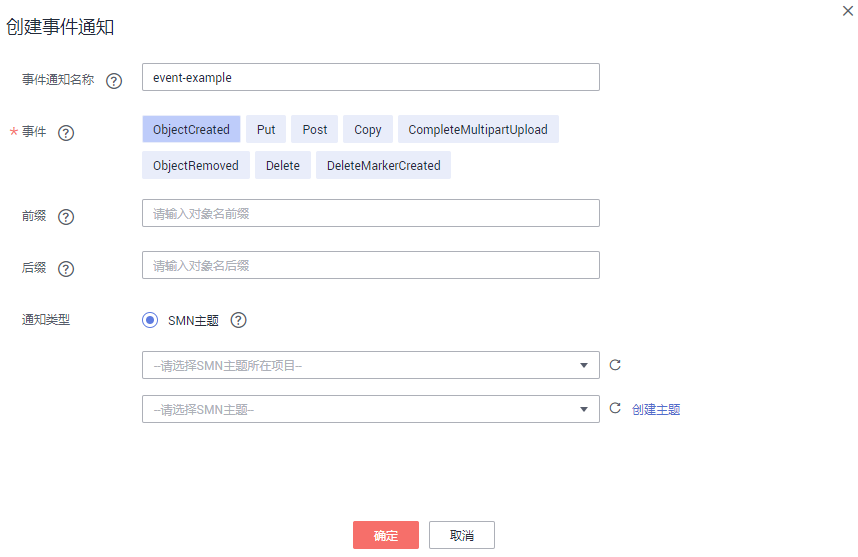

# 配置SMN通知

本节介绍如何在OBS控制台配置SMN通知。

## 背景知识

请参见[SMN通知简介](SMN通知简介.md)。

## 操作步骤

1.  在OBS管理控制台左侧导航栏选择“对象存储“。
2.  在桶列表单击待操作的桶，进入“概览”页面。
3.  在“基础配置”下，单击“事件通知”卡片，系统跳转至“事件通知”界面。

    或您可以直接在左侧导航栏单击“基础配置\>事件通知”，进入“事件通知”界面。

4.  单击“创建”，系统弹出“创建事件通知”对话框，如[图1](#fig17847723015)所示。

    **图 1**  创建事件通知  
    

5.  配置事件通知参数，参数说明如[表1](#aobs_console_0039_mmccppss_table01)所示。

    **表 1**  事件通知参数说明

    
    <table><thead align="left"><tr id="row2055942"><th class="cellrowborder" valign="top" width="25%" id="mcps1.2.3.1.1">
参数

    </th>
    <th class="cellrowborder" valign="top" width="75%" id="mcps1.2.3.1.2">
说明

    </th>
    </tr>
    </thead>
    <tbody><tr id="row12616447"><td class="cellrowborder" valign="top" width="25%" headers="mcps1.2.3.1.1 ">
事件通知名称

    </td>
    <td class="cellrowborder" valign="top" width="75%" headers="mcps1.2.3.1.2 ">
新增事件的名称，用户自定义。若不填写，系统将默认自动生成一个全局唯一ID作为名称。

    </td>
    </tr>
    <tr id="row13110201"><td class="cellrowborder" valign="top" width="25%" headers="mcps1.2.3.1.1 ">
事件

    </td>
    <td class="cellrowborder" valign="top" width="75%" headers="mcps1.2.3.1.2 ">
事件类型。目前，OBS支持对以下事件类型进行事件通知。

    <ul id="ul43540403"><li><strong id="b2253084295127">ObjectCreated：</strong>表示所有创建对象的操作，包含Put、Post、Copy对象以及合并段。</li><li><strong id="b21739820154642">Put</strong>：使用Put方法上传对象。</li><li><strong id="b7554011173727">Post</strong>：使用Post方法上传对象。</li><li><strong id="b19295192">Copy</strong>：使用copy方法复制对象。</li><li><strong id="b6205384517382">CompleteMultipartUpload</strong>：表示合并分段任务。</li><li><strong id="b4214016595037">ObjectRemoved：</strong>表示删除对象。</li><li><strong id="b28442244">Delete</strong>：指定对象版本号删除对象。</li><li><strong id="b22120394">DeleteMarkerCreated</strong>：不指定对象版本号删除对象。</li></ul>
    
多个事件类型可以作用于同一个目标对象，例如：同时选择“事件类型”复选框中的<strong id="b46921489">Put</strong>、<strong id="b19640220">Copy</strong>、<strong id="b42544256">Delete</strong>等方法作用于某目标对象，则用户往该桶中上传、复制、删除符合前后缀规则的目标对象时，均会发送事件通知给用户。<strong id="b41674970143835">ObjectCreated</strong>包含了<strong id="b15574064143840">Put</strong>、<strong id="b62119592143845">Post</strong>、<strong id="b7081676143849">Copy</strong>和<strong id="b31607544151827">CompleteMultipartUpload</strong>，如果选择了<strong id="b63678108143857">ObjectCreated</strong>，则不能再选择<strong id="b39981405143910">Put</strong>、<strong id="b17268397143910">Post</strong>、<strong id="b56562934143910">Copy</strong>或<strong id="b59319998143915">CompleteMultipartUpload</strong>。同理如果选择了<strong id="b44527778143920">ObjectRemoved</strong>，则不能再选择<strong id="b57045165143925">Delete</strong>或<strong id="b40642771143930">DeleteMarkerCreated</strong>。

    </td>
    </tr>
    <tr id="row47353991"><td class="cellrowborder" valign="top" width="25%" headers="mcps1.2.3.1.1 ">
前缀

    </td>
    <td class="cellrowborder" valign="top" width="75%" headers="mcps1.2.3.1.2 ">
指定事件作用的目标对象的前缀。

    
 说明： 

当前缀和后缀都不配置时，事件通知规则将作用于桶中所有对象。

    

    </td>
    </tr>
    <tr id="row16547757"><td class="cellrowborder" valign="top" width="25%" headers="mcps1.2.3.1.1 ">
后缀

    </td>
    <td class="cellrowborder" valign="top" width="75%" headers="mcps1.2.3.1.2 ">
指定事件作用的目标对象的后缀。

    
 说明： 
<ul id="ul75801343183518"><li>文件夹是以“/”结尾的，“/”前的字符为文件夹名称。对文件夹的相关操作做事件通知时，若要匹配后缀，后缀必须以“/”结尾。</li><li>当前缀和后缀都不配置时，事件通知规则将作用于桶中所有对象。</li></ul>
    

    </td>
    </tr>
    <tr id="row16019620144324"><td class="cellrowborder" rowspan="2" valign="top" width="25%" headers="mcps1.2.3.1.1 ">
SMN主题

    </td>
    <td class="cellrowborder" valign="top" width="75%" headers="mcps1.2.3.1.2 ">
项目：选择SMN主题所在的项目。

    
项目用于管理和分类所有的云资源，包括SMN主题。项目不同，对应的SMN主题也不相同，请先选择项目再选择主题。

    </td>
    </tr>
    <tr id="row13603062"><td class="cellrowborder" valign="top" headers="mcps1.2.3.1.1 ">
主题：选择已授权给OBS发布消息的SMN主题。SMN主题需通过SMN页面创建。
 说明： 
<ul id="ul290173585413"><li class="NotesTextinTable">SMN主题配置成功后，请不要随意删除与OBS管理控制台事件相关联的主题，也不要取消与OBS管理控制台事件相关联主题对OBS的授权。</li><li class="NotesTextinTable">若与OBS管理控制台事件相关联的主题被删除或取消该主题对OBS的授权，则可能出现以下现象：
a. 对应主题的订阅者无法收到消息。

    
b. 修改当前桶的事件配置，会自动清理不可用主题对应配置。

    </li><li>详细的使用SMN服务的操作指导请参见《消息通知服务用户指南》的“创建主题”、“添加订阅者”和“主题策略”章节的内容。</li></ul>
    

    

    </td>
    </tr>
    </tbody>
    </table>

6.  单击“确定”。

## 相关操作

您可以单击待操作的事件通知实例后面的“编辑”，编辑修改事件通知；单击“删除”，删除事件通知。

若您要批量删除事件通知，选中待删除的事件通知实例，单击列表上方的“删除”，完成批量删除。

