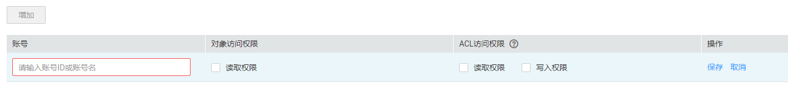

# 配置对象的ACL权限

OBS固定有拥有者、匿名用户、注册用户组设置对象ACL权限的功能。

## 操作步骤

1.  在OBS管理控制台桶列表中，单击待操作的桶，进入“概览”页面。
2.  在左侧导航栏，单击“对象”。
3.  单击待操作的对象。
4.  在“对象ACL”中，单击“编辑”按需求通过勾选相应权限对拥有者、注册用户组、匿名用户赋予目标对象的ACL权限。

    > **说明：**   
    >不能对已加密的对象设置注册用户和匿名用户的ACL权限。  

5.  **可选**：单击“增加”，如[图1](#fig3474335195326)所示。

    输入特定用户的“账号ID”或“账号名”，并为其设定相应的ACL权限。“账号ID”或“账号名”可通过“我的凭证”页面查看。

    **图 1**  添加对象的ACL权限  
    

6.  单击“保存”。

