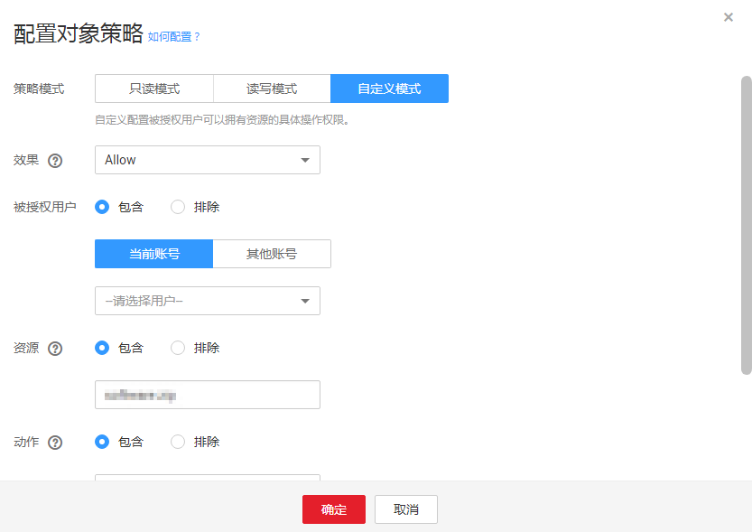

# 配置对象策略

对象策略提供了比对象ACL更加细致的权限控制。

## 操作步骤

1.  在OBS管理控制台桶列表中，单击待操作的桶，进入“概览”页面。
2.  在左侧导航栏，单击“对象”。
3.  在待操作的对象的后面，单击“更多\>配置对象策略”，系统弹出“配置对象策略”对话框。
4.  根据需求选择合适的策略模式。

    -   只读模式：被授权用户将拥有该对象的读权限，后续操作请参见[5](#li3552175452220)。
    -   读写控制：被授权用户将拥有该对象的读写权限，后续操作请参见[5](#li3552175452220)。
    -   自定义模式：自定义配置被授权用户可以拥有的对象的操作权限，具体参数配置请参见[6](#li588503161565)。

    > **说明：**   
    >一次只能配置一种策略模式的对象策略。  

5.  （只读模式或读写模式）依次输入被授权用户和资源，然后单击“确定”，完成对象策略配置。

    **表 1**  只读/读写模式下对象策略参数说明

    
    <table><thead align="left"><tr id="row27504174239"><th class="cellrowborder" valign="top" width="15.151515151515152%" id="mcps1.2.4.1.1">
字段

    </th>
    <th class="cellrowborder" valign="top" width="37.37373737373738%" id="mcps1.2.4.1.2">
值

    </th>
    <th class="cellrowborder" valign="top" width="47.474747474747474%" id="mcps1.2.4.1.3">
描述

    </th>
    </tr>
    </thead>
    <tbody><tr id="row8783617122317"><td class="cellrowborder" valign="top" width="15.151515151515152%" headers="mcps1.2.4.1.1 ">
被授权用户

    </td>
    <td class="cellrowborder" valign="top" width="37.37373737373738%" headers="mcps1.2.4.1.2 "><ul id="ul278810179232"><li>包含、排除</li><li>当前账号、其他账号</li></ul>
    </td>
    <td class="cellrowborder" valign="top" width="47.474747474747474%" headers="mcps1.2.4.1.3 ">
对象策略作用于的用户。

    <ul id="ul181061732318"><li>包含：指定作用于某用户。</li><li>排除：指定不作用于某用户。</li></ul>
    </td>
    </tr>
    <tr id="row081741752319"><td class="cellrowborder" valign="top" width="15.151515151515152%" headers="mcps1.2.4.1.1 ">
资源

    </td>
    <td class="cellrowborder" valign="top" width="37.37373737373738%" headers="mcps1.2.4.1.2 ">
包含、排除

    </td>
    <td class="cellrowborder" valign="top" width="47.474747474747474%" headers="mcps1.2.4.1.3 ">
对象策略作用于的资源。。

    <ul id="ul7842111712310"><li>包含：指对该OBS资源生效。</li><li>排除：指不对该OBS资源生效。</li></ul>
    </td>
    </tr>
    </tbody>
    </table>

6.  （自定义模式）在[图1](#fig53211555145821)中，根据实际需求配置各参数，然后单击“确定”，完成对象策略配置。

    **图 1**  对象策略  
    

    各字段的含义如[表2](#table25824246144542)所示。 

    **表 2**  自定义模式下对象策略参数说明

    
    <table><thead align="left"><tr id="row20874365144542"><th class="cellrowborder" valign="top" width="20.202020202020204%" id="mcps1.2.4.1.1">
字段

    </th>
    <th class="cellrowborder" valign="top" width="34.343434343434346%" id="mcps1.2.4.1.2">
值

    </th>
    <th class="cellrowborder" valign="top" width="45.45454545454546%" id="mcps1.2.4.1.3">
描述

    </th>
    </tr>
    </thead>
    <tbody><tr id="row10774617144542"><td class="cellrowborder" valign="top" width="20.202020202020204%" headers="mcps1.2.4.1.1 ">
效果

    </td>
    <td class="cellrowborder" valign="top" width="34.343434343434346%" headers="mcps1.2.4.1.2 ">
Allow、Deny

    </td>
    <td class="cellrowborder" valign="top" width="45.45454545454546%" headers="mcps1.2.4.1.3 ">
对象策略的效果。

    <ul id="ul2047392925512"><li>Allow：指定本条对象策略描述的权限为接受请求。</li><li>Deny：指定本条对象策略描述的权限为拒绝请求。</li></ul>
    </td>
    </tr>
    <tr id="row46881427144542"><td class="cellrowborder" valign="top" width="20.202020202020204%" headers="mcps1.2.4.1.1 ">
被授权用户

    </td>
    <td class="cellrowborder" valign="top" width="34.343434343434346%" headers="mcps1.2.4.1.2 "><ul id="ul19561211185417"><li>包含、排除</li><li>当前账号、其他账号</li></ul>
    </td>
    <td class="cellrowborder" valign="top" width="45.45454545454546%" headers="mcps1.2.4.1.3 ">
对象策略作用于的用户。

    <ul id="ul20577841145917"><li>包含：指定作用于某用户。</li><li>排除：指定不作用于某用户。</li></ul>
    </td>
    </tr>
    <tr id="row26311294144542"><td class="cellrowborder" valign="top" width="20.202020202020204%" headers="mcps1.2.4.1.1 ">
资源

    </td>
    <td class="cellrowborder" valign="top" width="34.343434343434346%" headers="mcps1.2.4.1.2 "><ul id="ul151711055754"><li>包含、排除</li></ul>
    </td>
    <td class="cellrowborder" valign="top" width="45.45454545454546%" headers="mcps1.2.4.1.3 ">
对象策略作用于的资源。

    <ul id="ul59851347012"><li>包含：指对该OBS资源生效。</li><li>排除：指不对该OBS资源生效。</li></ul>
    </td>
    </tr>
    <tr id="row461371117754"><td class="cellrowborder" valign="top" width="20.202020202020204%" headers="mcps1.2.4.1.1 ">
动作

    </td>
    <td class="cellrowborder" valign="top" width="34.343434343434346%" headers="mcps1.2.4.1.2 "><ul id="ul732518295298"><li>包含、排除</li><li>详细的动作信息，请参见<a href="对象策略简介.md#table1898522518162">对象相关动作含义</a>。</li></ul>
    </td>
    <td class="cellrowborder" valign="top" width="45.45454545454546%" headers="mcps1.2.4.1.3 ">
对象策略描述的操作。

    <ul id="ul6624457113019"><li>包含：指该动作描述的操作生效。</li><li>排除：指该动作描述的操作不生效。</li></ul>
    </td>
    </tr>
    <tr id="row8998688144542"><td class="cellrowborder" valign="top" width="20.202020202020204%" headers="mcps1.2.4.1.1 ">
条件

    </td>
    <td class="cellrowborder" valign="top" width="34.343434343434346%" headers="mcps1.2.4.1.2 "><ul id="ul63480483323"><li>条件运算符：请参见<a href="对象策略简介.md#table123951040181917">各条件运算符含义</a>。</li><li>键：请参见<a href="对象策略简介.md#table9684187102015">通用键</a>和<a href="对象策略简介.md#table13921537142011">与对象动作相关的键</a>。</li><li>值：输入的值与键相关。</li></ul>
    </td>
    <td class="cellrowborder" valign="top" width="45.45454545454546%" headers="mcps1.2.4.1.3 ">
对象策略生效的条件。

    </td>
    </tr>
    </tbody>
    </table>

7.  单击“确定”。

    对象策略配置成功后，可在“高级桶策略”下查看到该策略。

