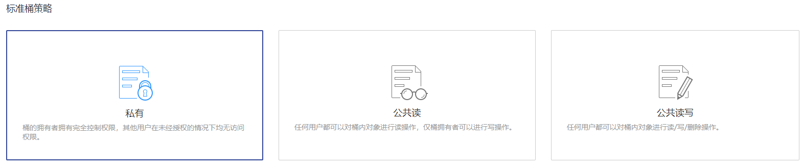

# 配置标准桶策略

标准桶策略可一键式为桶配置私有、公共读、或公共读写的通用策略。

## 操作步骤

1.  在OBS管理控制台左侧导航栏选择“对象存储“。
2.  在桶列表单击待操作的桶，进入“概览”页面。
3.  在左侧导航栏，单击“访问权限控制”，进入权限管理页面。
4.  在“桶策略”页面，“标准桶策略”下通过单击选中卡片配置标准桶策略。

    -   私有：除桶ACL授权外的其他用户无桶的访问权限。
    -   公共读：任何用户都可以对桶内对象进行读操作。
    -   公共读写：任何用户都可以对桶内对象进行读/写/删除操作。

    > **说明：**   
    >为了确保您的数据安全，不推荐配置为公共读或公共读写。  

    **图 1**  标准桶策略  
    

5.  在弹出的对话框中单击“是”。

