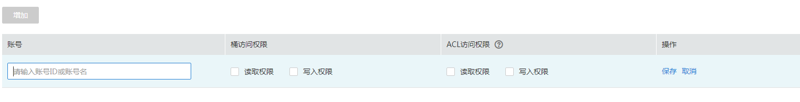

# 配置桶ACL

## 操作步骤

1.  在OBS管理控制台左侧导航栏选择“对象存储“。
2.  在桶列表单击待操作的桶，进入“概览”页面。
3.  在左侧导航栏，单击“访问权限控制”，进入权限管理页面。
4.  在“桶ACL”中，单击“编辑”可按照需求通过勾选相应权限对拥有者、注册用户组、匿名用户以及日志投递用户组赋予目标桶的ACL权限。
5.  **可选**：单击“桶ACL\>增加”，可对特定用户添加ACL权限的功能，如[图1](#fig28074666202331)所示。

    输入特定用户的“账号ID”或“账号名”，并为其设定相应的ACL权限。“账号ID”或“账号名”可通过“我的凭证”页面查看。

    **图 1**  添加权限  
    

6.  单击“保存”。

## 后续操作

通过桶ACL授予指定账号或注册用户组一定权限后，被授权用户即可使用自己的身份凭证（访问密钥AK和SK）通过OBS Browser挂载外部桶的方式访问该桶，详细操作请参见[挂载外部桶](https://support.huaweicloud.com/clientogw-obs/obs_03_0433.html)。

授予匿名用户一定权限后，匿名用户可以在不经过任何身份认证的情况下访问该桶。由于匿名用户可以是注册用户，也可以是非注册用户，注册用户可以直接通过以上两种方式访问桶。而非注册用户一般可以通过以下方式访问桶：

-   通过桶的访问域名，在浏览器中直接打开，可以查看到桶内对象列表。
-   通过在第三方系统配置桶的访问域名，与桶直接对接。

