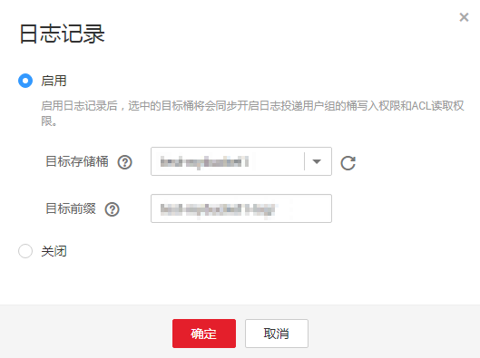

# 配置桶的日志记录

当一个桶开启了日志记录功能后，OBS自动将该桶的日志按照固定的命名规则，生成一个对象写入用户指定的桶。

## 操作步骤

1.  在OBS管理控制台左侧导航栏选择“对象存储“。
2.  在桶列表单击待操作的桶，进入“概览”页面。
3.  在“基础配置”下，单击“日志记录”卡片，系统弹出“日志记录”对话框。
4.  选择“启用”，如[图1](#fig17700501192958)所示。

    **图 1**  日志记录  
    

5.  选择“日志存储桶”（已经存在的桶），指定日志文件存储的桶。选定的日志存储桶的日志投递用户组会自动被赋予读取ACL权限和桶的写入权限。
6.  设置“日志文件前缀”，指定日志文件的前缀。

    启用日志记录功能后，生成的日志文件根据如下规则命名：

    _<日志文件前缀\>_YYYY-mm-DD-HH-MM-SS-_<UniqueString\>_

    -   _<日志文件前缀\>_为用户指定的日志文件日志存储前缀。
    -   **YYYY-mm-DD-HH-MM-SS**为日志生成的日期与时间，各字段依次表示年、月、日、时、分、秒。
    -   _<UniqueString\>_为OBS自动生成的字符串。

    在管理控制台中，如果配置的目标前缀_<日志文件前缀\>_以斜杠**/**结尾，则该桶生成的日志文件在目标桶中将统一存放在以_<日志文件前缀\>_命名的文件夹中，方便您进行管理。

    例如：

    -   如果配置日志存储桶为**bucket**，日志文件前缀为**bucket-log/**，则所有日志都将保存在**bucket**内的文件夹**bucket-log**中。日志命名举例：**2015-06-29-12-22-07-N7MXLAF1BDG7MPDV**。
    -   如果配置日志存储桶为**bucket**，日志文件前缀为**bucket-log**，则所有日志都将直接保存在**bucket**中。日志命名举例：**bucket-log2015-06-29-12-22-07-N7MXLAF1BDG7MPDV**。

    日志记录设置成功后，大约15分钟后可在日志存储桶中查看到桶的操作日志。

7.  单击“确定”。

## 相关操作

若您不再需要记录日志，在“日志记录”对话框，勾选“关闭”后，单击“确定”。关闭“日志记录”后，日志不再保存，之前保存的日志仍然在目标桶。

