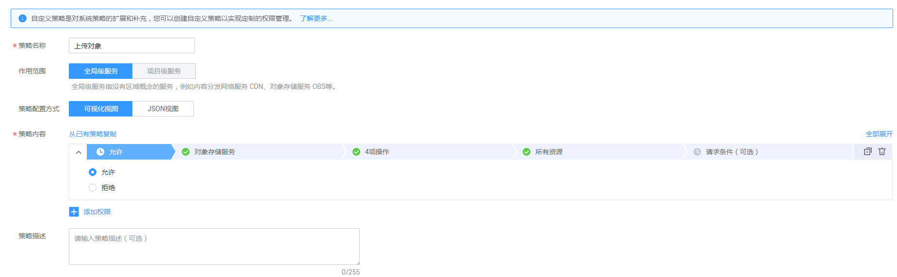

# 配置细粒度策略<a name="obs_03_0121"></a>

如果系统预置的OBS权限，不满足您的授权要求，可以创建自定义策略。自定义策略中可以添加的授权项（Action）请参考[桶相关授权项](https://support.huaweicloud.com/api-obs/zh-cn_topic_0173616349.html)和[对象相关授权项](https://support.huaweicloud.com/api-obs/zh-cn_topic_0174453173.html)。

目前华为云支持以下两种方式创建自定义策略：

-   可视化视图创建自定义策略：无需了解策略语法，按可视化视图导航栏选择云服务、操作、资源、条件等策略内容，可自动生成策略。
-   JSON视图创建自定义策略：可以在选择策略模板后，根据具体需求编辑策略内容；也可以直接在编辑框内编写JSON格式的策略内容。

如下以定制一个用户能列举桶、获取桶元数据，并在所有桶中列举对象和上传对象的策略为例，分别采用可视化视图和JSON视图的配置方式创建自定义策略。

## 前提条件<a name="section968314381933"></a>

-   请先在IAM控制台中开通细粒度策略，开通方法请参见：[申请细粒度访问控制公测](https://support.huaweicloud.com/usermanual-iam/iam_01_019.html)。
-   如需使用JSON视图创建自定义策略，请您先熟悉策略结构，具体请参见[策略结构&语法](IAM策略.md#section9268135516548)。
-   请确定自定义策略需要允许哪些操作，拒绝哪些操作，并获取操作对应的授权项。授权项请参见：[桶相关授权项](https://support.huaweicloud.com/api-obs/zh-cn_topic_0173616349.html)和[对象相关授权项](https://support.huaweicloud.com/api-obs/zh-cn_topic_0174453173.html)。

## 可视化视图配置自定义策略<a name="section1070555313172"></a>

1.  在IAM控制台，单击左侧导航栏的“策略”，在右上角选择“创建自定义策略”。
2.  在“创建自定义策略”中，配置如下信息：

    **图 1**  创建自定义策略<a name="fig2025419071210"></a>  
    

    -   “策略名称”：按需填写自定义策略的名称，如“上传对象”。
    -   “作用范围”：根据服务的属性填写，OBS为全局级服务，选择“全局级服务”。
    -   “策略配置方式”：可视化视图。
    -   “策略内容”：
        1.  选择“允许”。
        2.  在“云服务”中选择“对象存储服务”。
        3.  在“操作”中勾选“ReadWrite”中的“obs:bucket:PutObject”，即上传对象。
        4.  在“操作”中勾选“ListOnly”中的“obs:bucket:ListAllMyBuckets”、“obs:bucket:HeadBucket”和“obs:bucket:ListBucket”，即列举桶、获取桶元数据和列举对象。
        5.  在“资源”中选择“所有资源”。
        6.  单击“确定”后，自定义策略创建成功。


## JSON视图配置自定义策略<a name="section178541624121813"></a>

1.  在IAM控制台，单击左侧导航栏的“策略”，在右上角选择“创建自定义策略”。
2.  在“创建自定义策略”中，填写如下参数：
    -   “策略名称”：按需填写自定义策略的名称，如“上传对象”。
    -   “作用范围”：根据服务的属性填写，OBS为全局级服务，选择“全局级服务”。
    -   “策略配置方式”：JSON视图。
    -   “策略内容”：将如下内容拷贝至策略内容中。如下策略表示允许列举桶、获取桶元数据，并在所有桶中列举对象和上传对象。

        ```
        {
            "Version": "1.1",
            "Statement": [
                {
                    "Effect": "Allow",
                    "Action": [
                        "obs:bucket:HeadBucket",
                        "obs:bucket:ListAllMyBuckets",
                        "obs:bucket:ListBucket",
                        "obs:object:PutObject"
                    ]
                }
            ]
        }
        ```

3.  单击“确定”后，系统会自动校验语法，如跳转到策略列表，则自定义策略创建成功；如提示“策略内容错误”，请按照语法规范进行修改。

## 验证自定义策略权限<a name="section1511448181813"></a>

1.  将新创建的自定义策略授予用户组，使得用户组中的用户仅具备创建桶的权限。
2.  用户登录并验证自定义策略定义的权限。

    权限授予成功后，用户可以通过控制台、工具、API以及SDK等多种方式验证。


## 策略样例<a name="section10809111016198"></a>

-   示例1：给用户授予OBS的所有权限

    此策略表示用户可以对OBS进行任何操作。

    ```
    {
        "Version": "1.1",
        "Statement": [
            {
                "Effect": "Allow",
                "Action": [
                    "obs:*:*"
                ]
            }
        ]
    }
    ```

-   示例2：给用户授予OBS控制台的所有权限

    此策略表示用户可以在控制台对OBS进行所有操作。

    由于用户登录OBS控制台时，会访问一些其他服务的资源，如CTS审计信息，CDN加速域名，KMS密钥等。因此除了配置和示例1同样的OBS权限外，还需要配置其他服务的访问权限。其中CDN属于全局服务，CTS、KMS、SMN等属于区域级服务，需要根据您实际使用到的服务和区域分别在全局项目和对应区域项目中配置**Tenant Guest**权限。

    ```
    {
        "Version": "1.1",
        "Statement": [
            {
                "Effect": "Allow",
                "Action": [
                    "obs:*:*"
                ]
            }
        ]
    }
    ```

-   示例3：给用户授予桶的只读权限（不限定目录）

    此策略表示用户可以对桶obs-example下的所有对象进行列举和下载。

    ```
    {
        "Version": "1.1",
        "Statement": [
            {
                "Effect": "Allow",
                "Action": [
                    "obs:object:GetObject",
                    "obs:bucket:ListBucket"
                ],
                "Resource": [
                    "obs:*:*:object:obs-example/*",
                    "obs:*:*:bucket:obs-example"
                ]
            }
        ]
    }
    ```

-   示例4：给用户授予桶的只读权限（限定目录）

    此策略表示用户只能下载桶obs-example中“my-project/“目录下的所有对象，其他目录下的对象虽然可以列举，但无法下载。

    ```
    {
        "Version": "1.1",
        "Statement": [
            {
                "Effect": "Allow",
                "Action": [
                    "obs:object:GetObject",
                    "obs:bucket:ListBucket"
                ],
                "Resource": [
                    "obs:*:*:object:obs-example/my-project/*",
                    "obs:*:*:bucket:obs-example"
                ]
            }
        ]
    }
    ```

-   示例5：给用户授予桶的读写权限（限定目录）

    此策略表示用户可以对桶obs-example中“my-project“目录下的所有的对象进行列举、下载、上传和删除。

    ```
    {
        "Version": "1.1",
        "Statement": [
            {
                "Effect": "Allow",
                "Action": [
                    "obs:object:GetObject",
                    "obs:object:ListMultipartUploadParts",
                    "obs:bucket:ListBucket",
                    "obs:object:DeleteObject",
                    "obs:object:PutObject"
                ],
                "Resource": [
                    "obs:*:*:object:obs-example/my-project/*",
                    "obs:*:*:bucket:obs-example"
                ]
            }
        ]
    }
    ```

-   示例6：给用户授予桶的所有权限

    此策略表示用户可以对桶obs-example进行任何操作。

    ```
    {
        "Version": "1.1",
        "Statement": [
            {
                "Effect": "Allow",
                "Action": [
                    "obs:*:*"
                ],
                "Resource": [
                    "obs:*:*:bucket:obs-example",
                    "obs:*:*:object:obs-example/*"
                ]
            }
        ]
    }
    ```


