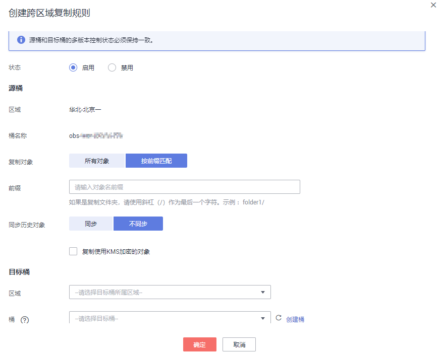

# 配置跨区域复制

当前，OBS支持一个源桶到一个目标桶配置一条复制所有对象的跨区域复制规则，或多条按前缀匹配的跨区域复制规则。

## 前提条件

-   源桶的版本号为3.0及以上，并且源桶所在区域支持跨区域复制功能。
-   待配置跨区域复制的源桶已经启用多版本控制。

## 操作步骤

1.  在OBS管理控制台桶列表中，单击待操作的桶，进入“概览”页面。
2.  在左侧导航栏，单击“跨区域复制”。
3.  单击“创建规则”，系统将弹出如[图1](#fig63211341214612)所示对话框。

    **图 1**  创建跨区域复制规则  
    

    > **说明：**   
    >-   源桶和目标桶的多版本控制状态必须保持一致。  
    >-   一个源桶的跨区域复制只能有一个目标桶和IAM委托，后面创建的规则中的目标桶和IAM委托会覆盖已创建规则的目标桶和委托。  

4.  根据业务规划配置跨区域复制规则，参数的详细说明如[表1](#table6195068921495)所示。

    **表 1**  跨区域复制规则参数

    
    <table><thead align="left"><tr id="row4965471321495"><th class="cellrowborder" colspan="2" valign="top" id="mcps1.2.4.1.1">
参数

    </th>
    <th class="cellrowborder" valign="top" id="mcps1.2.4.1.2">
说明

    </th>
    </tr>
    </thead>
    <tbody><tr id="row443080921495"><td class="cellrowborder" colspan="2" valign="top" headers="mcps1.2.4.1.1 ">
状态

    </td>
    <td class="cellrowborder" valign="top" headers="mcps1.2.4.1.2 ">
选择启用或者禁用当前规则。源桶和目标桶的多版本控制状态必须保持一致。

    </td>
    </tr>
    <tr id="row5981092521495"><td class="cellrowborder" rowspan="3" valign="top" width="14.14%" headers="mcps1.2.4.1.1 ">
源桶

    </td>
    <td class="cellrowborder" valign="top" width="24.5%" headers="mcps1.2.4.1.1 ">
复制对象

    </td>
    <td class="cellrowborder" valign="top" width="61.36000000000001%" headers="mcps1.2.4.1.2 ">
在源桶中选择要复制的对象。

    <ul id="ul34268730153058"><li>所有对象：复制所有对象到目标桶。</li><li>按前缀匹配：复制具有相同前缀的对象到目标桶。</li></ul>
    </td>
    </tr>
    <tr id="row1616511719513"><td class="cellrowborder" valign="top" headers="mcps1.2.4.1.1 ">
前缀

    </td>
    <td class="cellrowborder" valign="top" headers="mcps1.2.4.1.1 "><ul id="ul1420210213339"><li>按前缀匹配对象时，输入的对象名前缀不能为空，长度限制为1023个字节。</li><li>当按前缀配置时，如果指定的前缀名与某条已配置的规则指定的前缀名存在包含关系，OBS会将两条规则视为同一条，而禁止您配置本条规则。例如，系统中已存在指定前缀名为“abc”的规则，则不允许再配置指定前缀以“abc”字段开头的规则。</li><li>如果要复制文件夹，对象名前缀需要使用/作为最后一个字符（例如，imgs/）。</li></ul>
    </td>
    </tr>
    <tr id="row24800168141541"><td class="cellrowborder" valign="top" headers="mcps1.2.4.1.1 ">
复制使用KMS加密的对象

    </td>
    <td class="cellrowborder" valign="top" headers="mcps1.2.4.1.1 ">
选择是否复制已使用KMS加密的对象。若勾选该项，IAM委托也需要KMS加密权限。

    </td>
    </tr>
    <tr id="row35500343215138"><td class="cellrowborder" rowspan="3" valign="top" width="14.14%" headers="mcps1.2.4.1.1 ">
目标桶

    </td>
    <td class="cellrowborder" valign="top" width="24.5%" headers="mcps1.2.4.1.1 ">
区域

    </td>
    <td class="cellrowborder" valign="top" width="61.36000000000001%" headers="mcps1.2.4.1.2 ">
选择目标桶所在区域，目标桶需要与源桶处于不同区域。

    </td>
    </tr>
    <tr id="row35168852215147"><td class="cellrowborder" valign="top" headers="mcps1.2.4.1.1 ">
桶

    </td>
    <td class="cellrowborder" valign="top" headers="mcps1.2.4.1.1 ">
选择目标桶。如果目标桶没有启用多版本控制，您需要单击“启用多版本控制”来启用目标桶的多版本控制。

    </td>
    </tr>
    <tr id="row59588754215140"><td class="cellrowborder" valign="top" headers="mcps1.2.4.1.1 ">
修改复制对象的存储类别

    </td>
    <td class="cellrowborder" valign="top" headers="mcps1.2.4.1.1 ">
默认不勾选，即保持与源桶中对象的存储类别一致。勾选后可以配置复制到目标桶的对象的存储类别。

    </td>
    </tr>
    <tr id="row63407147215331"><td class="cellrowborder" valign="top" width="14.14%" headers="mcps1.2.4.1.1 ">
权限

    </td>
    <td class="cellrowborder" valign="top" width="24.5%" headers="mcps1.2.4.1.1 ">
IAM委托

    </td>
    <td class="cellrowborder" valign="top" width="61.36000000000001%" headers="mcps1.2.4.1.2 ">
选择一个IAM委托，您可以从下拉列表选择账号下已有的IAM委托，也可以单击“创建委托”去创建一个新的委托。OBS使用此委托执行对象的跨区域复制。

    
 说明： 
<ul id="ul11150722142723"><li>跨IAM委托需要“对象存储服务”项目具有Tenant Administrator权限，如果勾选了“复制使用KMS加密的对象”，还需要目标桶所属区域具有KMS Administrator权限。</li></ul>
    

    </td>
    </tr>
    </tbody>
    </table>

5.  （可选）创建IAM委托，参见[创建IAM委托](创建IAM委托.md)。
6.  单击“确定”，完成跨区域复制规则创建。

    > **说明：**   
    >跨区域复制只复制规则创建后的对象。  

