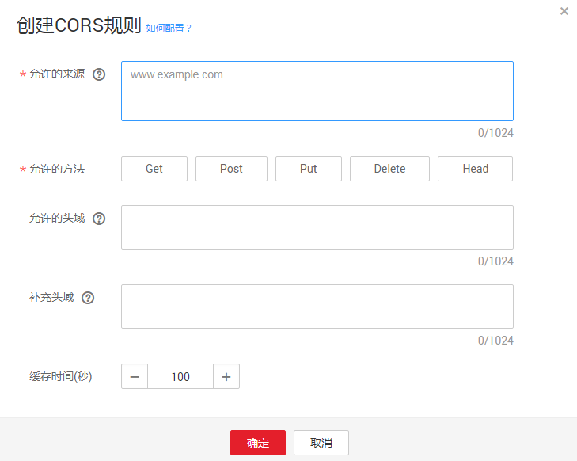

# 配置跨域资源共享

OBS提供HTML5协议中的CORS设置，帮助用户实现跨域访问。

## 前提条件

已经配置了静态网站托管。

## 操作步骤

1.  在OBS管理控制台桶列表中，单击待操作的桶，进入“概览”页面。
2.  在“基础配置”下，“CORS规则”卡片显示其当前状态。鼠标滑过“CORS规则”卡片，状态栏显示“配置”，单击“配置”，系统跳转至“CORS规则”界面。

    或您可以直接在左侧导航栏单击“基础配置\>CORS规则”，进入“CORS规则”界面。

3.  单击“创建”，系统弹出“创建CORS规则”对话框，如[图1](#fig2425430173411)所示。

    > **说明：**   
    >OBS最多可设置100条CORS规则。  

    **图 1**  创建CORS规则  
    

4.  在“CORS规则”中配置“允许的来源”、“允许的方法”、“允许的头域”、“补充头域”和“缓存时间”。

    CORS规则各参数解释如[表1](#obs_console_0010_mmccppss_tab01)所示：

    **表 1**  CORS规则

    
    <table><thead align="left"><tr id="row14261328"><th class="cellrowborder" valign="top" width="32%" id="mcps1.2.3.1.1">
参数

    </th>
    <th class="cellrowborder" valign="top" width="68%" id="mcps1.2.3.1.2">
解释

    </th>
    </tr>
    </thead>
    <tbody><tr id="row47932664"><td class="cellrowborder" valign="top" width="32%" headers="mcps1.2.3.1.1 ">
允许的来源

    </td>
    <td class="cellrowborder" valign="top" width="68%" headers="mcps1.2.3.1.2 ">
必选参数，指定允许的跨域请求的来源，即允许来自该域名下的请求访问该桶。

    
允许多条匹配规则，以回车换行为间隔。每个匹配规则允许使用最多一个“*”通配符。例如：

    <pre class="screen" id="screen5755676013302">http://rds.example.com
    https://*.vbs.example.com</pre>
    </td>
    </tr>
    <tr id="row18342472"><td class="cellrowborder" valign="top" width="32%" headers="mcps1.2.3.1.1 ">
允许的方法

    </td>
    <td class="cellrowborder" valign="top" width="68%" headers="mcps1.2.3.1.2 ">
必选参数，指定允许的跨域请求方法，即桶和对象的几种操作类型。包括：GET、POST、PUT、DELETE、HEAD。

    </td>
    </tr>
    <tr id="row34698981"><td class="cellrowborder" valign="top" width="32%" headers="mcps1.2.3.1.1 ">
允许的头域

    </td>
    <td class="cellrowborder" valign="top" width="68%" headers="mcps1.2.3.1.2 ">
可选参数，指定允许的跨域请求的头域。只有匹配上允许的头域中的配置，才被视为是合法的CORS请求。

    
允许的头域可设置多个，多个头域之间换行隔开，每行最多可填写一个*符号，不支持&amp;、:、&lt;、空格以及中文字符。

    </td>
    </tr>
    <tr id="row19218446"><td class="cellrowborder" valign="top" width="32%" headers="mcps1.2.3.1.1 ">
补充头域

    </td>
    <td class="cellrowborder" valign="top" width="68%" headers="mcps1.2.3.1.2 ">
可选参数，指CORS响应中带的补充头域，给客户端提供额外的信息。

    
补充头域可设置多个，多个头域之间换行隔开，不支持*、&amp;、:、&lt;、空格以及中文字符。

    </td>
    </tr>
    <tr id="row38454973"><td class="cellrowborder" valign="top" width="32%" headers="mcps1.2.3.1.1 ">
缓存时间

    </td>
    <td class="cellrowborder" valign="top" width="68%" headers="mcps1.2.3.1.2 ">
必选参数，请求来源的客户端可以缓存的CORS响应时间，以秒为单位，默认为100秒。

    </td>
    </tr>
    </tbody>
    </table>

5.  单击“确定”。

    “CORS规则”页签显示“已配置”提示创建桶的CORS配置成功。CORS配置会在两分钟内生效。

    CORS配置成功后，便仅允许跨域请求来源的地址通过允许的方法访问OBS的桶。例如：为桶“testbucket”允许的来源配置为“www.examlple.com”，允许的方法配置为“GET”，允许的头域和补充的头域置空，缓存时间设置为“100”，则OBS仅允许来源为“www.examlple.com”的“GET”请求访问桶“testbucket”，且不限制该请求的头域，请求来源的客户端可缓存的该CORS请求的响应时间为100秒。

