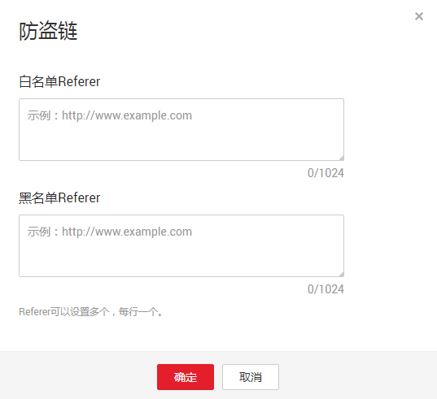

# 配置防盗链

OBS提供同时支持允许白名单访问和阻止黑名单访问的配置，防止盗链。

## 前提条件

已经配置了静态网站托管。

## 操作步骤

1.  在OBS管理控制台桶列表中，单击待操作的桶，进入“概览”页面。
2.  在左侧导航栏，单击“静态网站托管”。
3.  单击“防盗链设置”卡片，系统弹出如[图1](#fig53966499193827)所示对话框。

    **图 1**  配置防盗链  
    

    Referer规则如下：

    -   Referer格式：Referer可以设置多个，每行一个。
    -   白名单Referer为空，黑名单Referer不空时，允许所有黑名单中指定网站以外的其他网站的请求访问目标桶中的数据。
    -   白名单Referer不为空，黑名单Referer为空或不空时，只允许白名单中指定网站的请求访问目标桶中的数据。

    > **说明：**   
    >当白名单Referer与黑名单Referer内容一样时，黑名单生效。例如：当白名单Referer与黑名单Referer输入框中的referer字段都为“`www.example.com`”时，系统是阻止该请求访问的。  

    -   黑名单Referer与白名单Referer都为空时，默认允许所有网站的请求访问目标桶中的数据。
    -   用户只有通过URL签名或者匿名访问桶及其内容时，才会做防盗链验证。请求的Header中有**Authorization**字段的，不会做防盗链验证。
    -   判断用户是否有对桶及其内容访问的四种权限（读取权限、写入权限、ACL读取权限、ACL写入权限）之前，需要首先检查是否符合referer字段的防盗链规则。

4.  按需求输入Referer白名单或黑名单，输入的字节数不能超过1024个字符。

    举例：

    -   如果将桶名为“test-111”的桶，设置其“白名单Referer”为“`http://example.com`”，“黑名单Referer”为空，则只有referer为“`http://example.com`”的请求才能访问“test-111”这个桶中的数据。
    -   如果将桶名为“test-111”的桶，设置其“黑名单Referer”为“`http://example.com`”，“白名单Referer”为空，则允许referer为“`http://example.com`”以外的所有请求都能访问“test-111”这个桶中的数据。

5.  单击“确定”。

