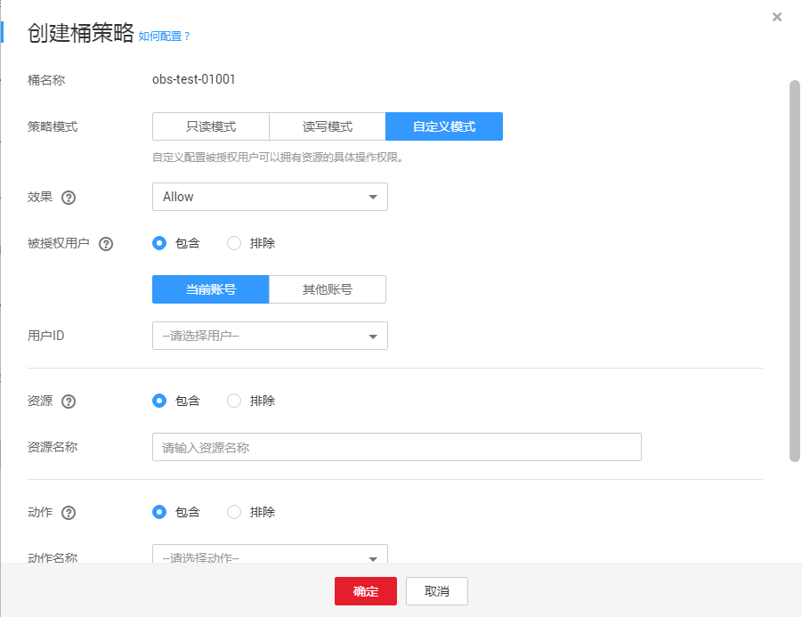

# 配置高级桶策略（普通模式）

如果期望给予特定用户特定的权限或其他需求，则可以在高级设置下配置。当标准桶策略和高级桶策略有冲突时，以高级桶策略\>标准桶策略的优先级顺序决定授权结果。

本示例介绍普通模式（图形界面）下高级桶策略的配置方法。

## 操作步骤

1.  在OBS管理控制台左侧导航栏选择“对象存储“。
2.  在桶列表单击待操作的桶，进入“概览”页面。
3.  在左侧导航栏，单击“访问权限控制”，进入权限管理页面。
4.  在“桶策略”页面“高级桶策略”下，根据需求配置高级桶策略。

    在“高级桶策略”列表的右上角，选择“普通模式”来配置桶策略。

5.  单击“创建桶策略”。根据需求选择合适的策略模式。

    -   只读模式：被授权用户将拥有桶内指定对象的读权限，后续操作请参见[6](#li3552175452220)。
    -   读写控制：被授权用户将拥有桶内指定对象的读写权限，后续操作请参见[6](#li3552175452220)。
    -   自定义模式：自定义配置被授权用户可以拥有的桶或对象的操作权限，具体参数配置请参照[7](#li588503161565)。

    > **说明：**   
    >一次只能配置一种策略模式的桶策略。  

6.  （只读模式或读写模式）依次输入被授权用户和资源，然后单击“确定”，完成桶策略配置。

    **表 1**  只读/读写模式下桶策略参数说明

    
    <table><thead align="left"><tr id="row27504174239"><th class="cellrowborder" valign="top" width="15.151515151515152%" id="mcps1.2.4.1.1">
字段

    </th>
    <th class="cellrowborder" valign="top" width="37.37373737373738%" id="mcps1.2.4.1.2">
值

    </th>
    <th class="cellrowborder" valign="top" width="47.474747474747474%" id="mcps1.2.4.1.3">
描述

    </th>
    </tr>
    </thead>
    <tbody><tr id="row8783617122317"><td class="cellrowborder" valign="top" width="15.151515151515152%" headers="mcps1.2.4.1.1 ">
被授权用户

    </td>
    <td class="cellrowborder" valign="top" width="37.37373737373738%" headers="mcps1.2.4.1.2 "><ul id="ul278810179232"><li>包含、排除</li><li>当前账号、其他账号</li></ul>
    </td>
    <td class="cellrowborder" valign="top" width="47.474747474747474%" headers="mcps1.2.4.1.3 ">
桶策略作用于的用户。

    <ul id="ul54266332416"><li>包含：桶策略对指定的用户生效。</li><li>排除：桶策略对除指定用户外的其他用户生效。</li></ul>
    </td>
    </tr>
    <tr id="row081741752319"><td class="cellrowborder" valign="top" width="15.151515151515152%" headers="mcps1.2.4.1.1 ">
资源

    </td>
    <td class="cellrowborder" valign="top" width="37.37373737373738%" headers="mcps1.2.4.1.2 "><ul id="ul2824151742319"><li>包含、排除</li><li>输入格式：
对象：<em id="i383261716237">对象名称</em>

    
对象集：<em id="i178352017182312">“<em id="i14836141718236">对象名称前缀</em>”+</em>“*”、“*”+“对象名后缀”或“*”

    </li></ul>
    </td>
    <td class="cellrowborder" valign="top" width="47.474747474747474%" headers="mcps1.2.4.1.3 ">
桶策略作用于的资源。在只读模式和读写模式下，作用的资源只能是对象。

    <ul id="ul3327155218415"><li>包含：桶策略对指定的OBS资源生效。</li><li>排除：桶策略对除设置外的其他OBS资源生效。</li></ul>
    </td>
    </tr>
    </tbody>
    </table>

7.  （自定义模式）根据实际需求配置自定义参数，然后单击“确定”，完成桶策略配置。

    **图 1**  自定义模式下桶策略配置  
    

    各字段的含义如[表2](#table25824246144542)所示。 

    **表 2**  自定义模式下桶策略参数说明

    
    <table><thead align="left"><tr id="row20874365144542"><th class="cellrowborder" valign="top" width="20.202020202020204%" id="mcps1.2.4.1.1">
字段

    </th>
    <th class="cellrowborder" valign="top" width="34.343434343434346%" id="mcps1.2.4.1.2">
值

    </th>
    <th class="cellrowborder" valign="top" width="45.45454545454546%" id="mcps1.2.4.1.3">
描述

    </th>
    </tr>
    </thead>
    <tbody><tr id="row10774617144542"><td class="cellrowborder" valign="top" width="20.202020202020204%" headers="mcps1.2.4.1.1 ">
效果

    </td>
    <td class="cellrowborder" valign="top" width="34.343434343434346%" headers="mcps1.2.4.1.2 ">
Allow、Deny

    </td>
    <td class="cellrowborder" valign="top" width="45.45454545454546%" headers="mcps1.2.4.1.3 ">
桶策略的效果。

    <ul id="ul64356178416"><li>Allow：指定本条桶策略描述的权限为接受请求。</li><li>Deny：指定本条桶策略描述的权限为拒绝请求。</li></ul>
    </td>
    </tr>
    <tr id="row46881427144542"><td class="cellrowborder" valign="top" width="20.202020202020204%" headers="mcps1.2.4.1.1 ">
被授权用户

    </td>
    <td class="cellrowborder" valign="top" width="34.343434343434346%" headers="mcps1.2.4.1.2 "><ul id="ul19561211185417"><li>包含、排除</li><li>当前账号、其他账号</li></ul>
    </td>
    <td class="cellrowborder" valign="top" width="45.45454545454546%" headers="mcps1.2.4.1.3 ">
桶策略作用于的用户。

    <ul id="ul18436161714415"><li>包含：桶策略对指定的用户生效。</li><li>排除：桶策略对除指定用户外的其他用户生效。</li></ul>
    </td>
    </tr>
    <tr id="row26311294144542"><td class="cellrowborder" valign="top" width="20.202020202020204%" headers="mcps1.2.4.1.1 ">
资源

    </td>
    <td class="cellrowborder" valign="top" width="34.343434343434346%" headers="mcps1.2.4.1.2 "><ul id="ul151711055754"><li>包含、排除</li><li>输入格式：
对象：<em id="i6492155010917">对象名称</em>

    
对象集：<em id="i7391726162">“<em id="i123262027121614">对象名称前缀</em>”+</em>“*”、“*”+“对象名后缀”或“*”

    
空：表示资源为整个桶

    </li></ul>
    </td>
    <td class="cellrowborder" valign="top" width="45.45454545454546%" headers="mcps1.2.4.1.3 ">
桶策略作用于的资源。

    <ul id="ul104361117846"><li>包含：桶策略对指定的OBS资源生效。</li><li>排除：桶策略对除设置外的其他OBS资源生效。</li></ul>
    
资源的类型与动作相关：

    <ul id="ul1943618171341"><li>资源为对象或对象集时，“动作”只能配置对象相关的动作。</li><li>资源为桶时，“动作”只能配置桶相关的动作。</li></ul>
    </td>
    </tr>
    <tr id="row461371117754"><td class="cellrowborder" valign="top" width="20.202020202020204%" headers="mcps1.2.4.1.1 ">
动作

    </td>
    <td class="cellrowborder" valign="top" width="34.343434343434346%" headers="mcps1.2.4.1.2 "><ul id="ul732518295298"><li>包含、排除</li><li>详细的动作信息，请参见<a href="动作.md">动作</a>。</li></ul>
    </td>
    <td class="cellrowborder" valign="top" width="45.45454545454546%" headers="mcps1.2.4.1.3 ">
桶策略描述的操作。

    <ul id="ul44361517746"><li>包含：桶策略对指定的动作生效。</li><li>排除：桶策略对除指定动作外的其他动作生效。</li></ul>
    </td>
    </tr>
    <tr id="row8998688144542"><td class="cellrowborder" valign="top" width="20.202020202020204%" headers="mcps1.2.4.1.1 ">
条件

    </td>
    <td class="cellrowborder" valign="top" width="34.343434343434346%" headers="mcps1.2.4.1.2 "><ul id="ul63480483323"><li>条件运算符：请参见<a href="条件.md#table16670126115713">表1</a>。</li><li>键：请参见<a href="条件.md#table6707152645718">通用键</a>、<a href="条件.md#table1972610267573">与桶动作有关的键</a>和<a href="条件.md#table14742526145718">与对象动作相关的键</a>。</li><li>值：输入的值与键相关。</li></ul>
    </td>
    <td class="cellrowborder" valign="top" width="45.45454545454546%" headers="mcps1.2.4.1.3 ">
桶策略生效的条件。

    </td>
    </tr>
    </tbody>
    </table>

